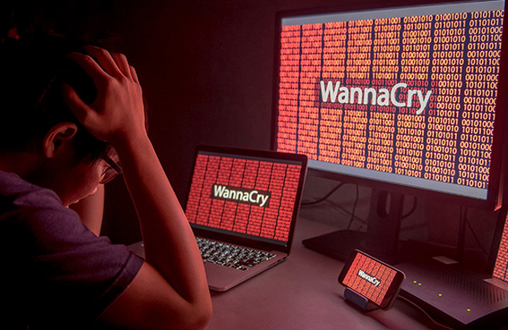

# Panorama della Sicurezza Cibernetica

Ciascuno di noi, nella vita normale, ha delle aspettative giustificate riguardo la propria incolumità fisica, la sicurezza dei propri averi e della propria abitazione, la privacy della propria vita individuale.

Con l'avvento di tecnologie informatiche, con la nostra immersione sempre più profonda in un mondo cibernetico, la nostra naturale aspettativa è che la sicurezza venga estesa anche a tale mondo.

Eppure costantemente ci accorgiamo che le nuove tecnologie hanno portato anche nuovi problemi di sicurezza, più virtuali che reali all'inizio, ma sempre più con conseguente impatto anche nel mondo reale e quotidiano.

E lo scenario dei problemi di sicurezza cibernetica si stà evolvendo col tempo. Mentre fino a qualche anno fà le preoccupazioni principali erano sulla diffusione dei virus dei computer, sullo _spam_ di posta elettronica, sulle interruzioni o malfunzionamento dei servizi, oggi sono apparse nuove minacce, quali il furto d'identità, il dossieraggio dei comportamenti, lo spionaggio attivo.

I problemi di _cybersecurity_ sono sì dovuti al maggiore coinvolgimento, e quasi indispensabilità dell'informatica, ma anche ad altri motivi.

Il principale motivo di fondo è la scarsa **consapevolezza** delle minacce informatiche. Anzichè prenderne atto e modificare di conseguenza gli strumenti usati e i comportamenti tenuti, molti individui si comportano come se l'informatica e l'uso della rete fosse _business as usual_ - affari come al solito. Si tratta invece di un profondo cambiamento paradigmatico.

Un secondo e forte motivo è la **inadeguatezza** intrinseca di molti programmi e protocolli, soprattutto quando accedono Internet. La grande rete, concepita a partire dai primi anni '70, comincia a evidenziare notevoli pecche di sicurezza, che semplicemente non erano state immaginate alla sua origine.

Evidentemente la prima causa efficace dei problemi sono i **criminali** informatici, che hanno imparato ad usare efficacemente i nuovi strumenti per i loro scopi illegali, più velocemente di quanto le loro vittime abbiano appreso per difendersi.

Si può forse compiere un'analogia tra l'incidenza moderna di crimine informatico e i tradizionali problemi fisici delle malattie e della salute.

L'organismo umano ha molti nemici naturali ed è soggetto a svariati tipi di malattie che a volte assumono dimensioni di epidemie.

In campo fisico si sono affermate nel tempo delle contromisure di base: si è molto elevato lo standard di igiene personale, studi approfonditi e continuativi hanno scoperto antidoti a numerosi virus e cure a molte malattie precedentemente mortali, enti sanitari di rapido intervento fanno fronte al repentino diffondersi di nuove epidemie.

Così anche in campo informatico si vanno affermando comportamenti e misure di carattere preventivo e _igienico_, vengono continuamente identificate contromisure a nuovi attacchi cibernetici, e varie Polizie Postali o Enti Nazionali di Difesa compiono un rapido intervento quando si verificano nuove _epidemie_ informatiche.

## Hacking: Alcuni Famosi Episodi

* 1988: Il Verme di Morris si diffonde in un’Internet primitiva ed infetta 6000 servers
* 1995: per vincere il premio “Chi prima chiama vince una Porsche” uno hacker blocca l’intero servizio telefonico di Los Angeles
* 1998: una squadra di hacker penetra e distrugge 500 computer Solaris del governo americano
* 1999: un giovane hacker entra nei computer NASA di controllo della stazione spaziale, che vengono chiusi per tre settimane
* 1999: il virus Melissa infetta milioni di sistemi Windows
* 2000: attacco di un ragazzo di 15 anni a CNN, Amazon, eBay e Yahoo, con perdita di 1.2 miliardi di dollari
* 2002: tutti i server DNS americani vengono spenti per un’ora
* 2009: la Cina penetra Google China e da lì capta milioni di messaggi di posta elettronica di cittadini americani
* 2009: uno hacker di Miami ruba dettagli di 10 milioni di carte di credito da 250 istituti finanziari

### Attacchi Recenti: 2017

* **Yahoo** ammette che, in una serie di attacchi, ogni singolo suo account (1 miliardo) è stato compromesso.
* Il gruppo hacker Shadow Brokers ruba un’arma virus della NSA, **Wannacry**, e la diffonde: almeno 100,000 PC e servers infetti e richieste di riscatto.
* Viene rivelata l’esistenza delle armi cibernetiche **Crash Override**, per l’attacco alla rete elettrica dell’Ucraina, e **Triton**, contro i sistemi industriali del Medio Oriente.
* **Uber** paga $100,000 per tener segreto il furto d’identità di 57 milioni di suoi utenti.
* La ditta di credito **Equifax** ammette il potenziale furto di credenziali dei suoi 147 milioni di utenti nel mondo.

## Percezione della Sicurezza

Non arrivando immediatamente ad un tentativo di definizione della _sicurezza informatica_, consideriamo come viene percepita da categorie professionali diverse che ne sono a contatto.

Per il **personale addetto alla sicurezza** i concetti sono più chiari e definiti. Si tratta di protezione dei dati, nei suoi principali aspetti di difesa della confidenzialità, integrità e disponibilità. Si tratta altresì di massimizzare la fiducia nel corretto comportamento degli applicativi informatici.

Per il **manager** però la sicurezza ha anche dei risvolti negativi. Si tratta innanzitutto di un costo di produzione aggiuntivo, e del dover far fronte a situazioni pericolose ed indesiderate. Viene quindi presto la considerazione che la sicurezza totale è _irraggiungibile_ e la necessità di trovare un giusto mezzo, efficace ma non troppo oneroso.

Per gli **utenti** poi la sicurezza informatica è percepita in modo piuttosto negativo. Vi sono regole nuove e considerate poco _ragionevoli_ che ostacolano alquanto il lavoro produttivo. Vi è inoltre la necessità di continui corsi di aggiornamento la cui utilità non è immediatamente evidente.

In realtà la sicurezza, ora informatica quanto in precedenza fisica, _deve_ essere una **preoccupazione di tutti**. Deve essere parte stessa della cultura dell'organizzazione, poichè protegge gli _asset_ e interessi aziendali. Deve essere **pervasiva**, insita in ogni processo aziendale.

Per renderla accettabile è indispensaabile che gli accorgimenti di sicurezza siano **possibili** e **semplici**. E' inoltre di notevole valore **evidenziare** il progresso e i risultati positivi che si conseguono con l'adozione di misure di sicurezza.
