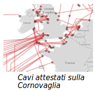
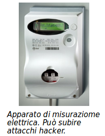

# Cyberwar

> La guerra è il proseguimento della politica con altri mezzi
Von Clausewitz

## Definizione

La guerra cibernetica (Cyberwar) è guerra con strumenti moderni basati (anche) sulla tecnologia informatica

### Aspetti

* Guerra fredda
  * _SigInt_ - acquisizione di intelligence, spionaggio
  * _PsyOps_ - operazioni di attacco psicologico subdolo
  * Acquisizione di capabilities ed esperienze
  * Interazione con agenzie di Intelligence ed Operazioni
* Guerra calda
  * _Command & Control_ - dominanza IT del campo operativo
  * _CyberWarfare_ - operazioni IT che causano danni fisici
  * _Cyber-Kinetic Warfare_ - supporto IT ad operazioni fisiche

## Attori

* **Five Eyes Alliance**
  * NSA - USA
  * GCHQ - UK
  * CSD - Canada
  * ASE - Australia
  * GCSB - Nuova Zelanda
* **Paesi NATO e Israele** (subordinati)
* **PLA3 cinese**
* **Russia**
* **Iran e Stati Arabi** (tecnologie acquistate)
* **Gruppi terroristici**
* **Gruppi libertari e coordinati di hackers**
  * Anonymous

## Iniziative

### Supercomputers

* **BullRun** e **LongHaul** - supercomputers NSA
  * Terzo supercomputer costruito nello Utah
  * _NSA Cryptanalysis and Exploitation Services_
* **Quick Ant** e **Flying Pig** - supercomputers UK GCHQ
  * Database e query di raccolta metadati di connessioni SSL/TLS mondiali (ca. 10 TB al giorno)
  * Permette attacchi Man-In-The-Middle

### Progetti

* **Disposition Matrix** aka US **Kill List**
  * Lista di terroristi e nemici che devono essere fisicamente eliminati. (Obama, 2010)
  * Prevede l'accettabilità di danni collaterali (vittime innocenti), differenziando tra americani e non.
* **PRISM**
  * Programma US di cattura globale di tutti i dati
  * Praticamente tutti i maggiori protocolli crittografici sono decrittati

## Policies di Ritenzione Dati

### GCHQ (UK)

* Tutto il traffico in arrivo, partenza o interno al Regno Unito è catturato in toto - metadati e contenuto - e conservato per 72 ore
* Anche il traffico in partenza e arrivo sui cavi dati USA-Europa attestati in Cornovaglia (40% del traffico mondiale)
* Filtri di rilevanza determinano classi di ritenzione ulteriore - fino a 10 anni

### NSA (US)

* Tutto il traffico mondiale rilevato direttamente o acquisito da Friends - di tutte le nazioni al mondo, senza consenso o conoscenza degli interessati
  * Soprattutto: anche i cittadini americani
* Tutti i metadati per 10 anni
* Contenuti interi e metadati a seconda della classe di sensitività - min 2, max 30 anni, in futuro: 100 anni

## Cyber-Kinetic Warfare

Identifica le interazioni tra guerra fisica e cibernetica:

* Attacchi fisici mirati dopo SigInt cyber
* Attacco cyber causa distruzione fisica
* Attacco fisico come risposta ad attacco cyber
  * Policy del Dipartimento della Difesa dal 2012
* Attacco fisico preventivo ad attacco cyber
  * Ai dispositivi cyber avversari

## SCADA

Non solo i sistemi individuali e aziendali sono soggetti ad attacchi. Particolare preoccupazione destano i sistemi SCADA.

### Supervisory Control And Data Acquisition

Monitoraggio e controllo di sistemi fisici industriali:

* Controllo di produzione
* Erogazione energia, acqua, ecc.
* Centrali nucleari
* Controllo rete

Le potenzialità di un attacco di successo potrebbero essere devastanti perchè:

* La popolazione civile è colpita
* Difficoltà di override manuale di sistemi altamente automatizzati
* Assenza di sistemi di backup e di ritorno al passato
