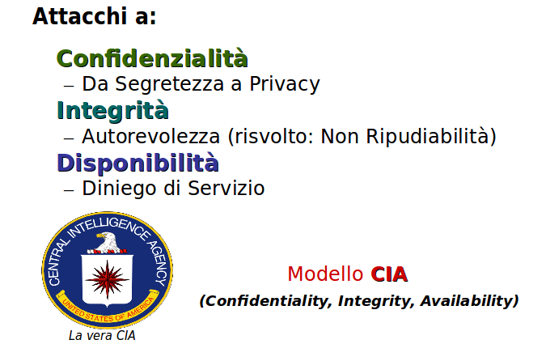
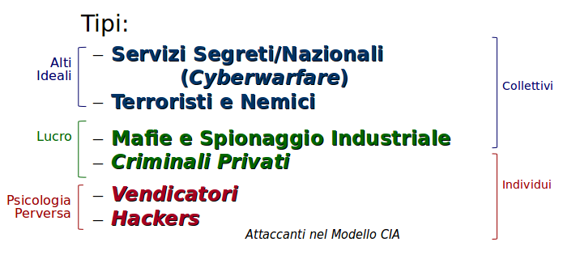

# Modelli di Sicurezza Informatica

Per poter capire cos'è e cosa coinvolge la sicurezza informatica è necessario un **modello** che la descriva, e dal quale sia posssibile trarre conseguenze e arrivare a decisioni.

Fin dagli anni '90 in America si è affermato il modello di sicurezza detto **Modello CIA**. Con varie sigle e alcune piccole varianti, questo modello rimane tuttora di base per l'intercomunicazione tra persone che si occupano di difesa informatica.

Il _Modello CIA_ non ha niente a che fare con l'omonima agenzia americana, nè questa ha partecipato alla stesura del modello. L'acronimo è l'abbreviazione in inglese dei termini:

* **Confidenziality** - Confidenzialità, Riservatezza
* **Integrity** - Integrità
* **Availability** - Disponibilità

L'acronimo, nella letteratura internazionale e anche italiana, compare tipicamente sempre come _CIA_ e non viene tradotto, come è il casso con molti termini informatici. Solo i francesi conducono il pervicace tentativo di tradurre ogni termine informatico.

Il _Modello CIA_ si preoccupa della sicurezza in termini di **dati** e **programmi eseguibili**. I tre termini dell'acronimo descrivono _qualità_ desiderabili. Sono un parallelo con i tre tipici permessi sui file di un filesystem: **lettura**, **scrittura** ed **esecuzione**.

## Confidenzialità

Mantenere la confidenzialità significa impedire che chi non è autorizzato venga a conoscenza dei dati.

Eè uno spettro di aspetti, i cui capi sono:

* **Segretezza**
  * Proprietà intellettuale
  * Piani del business
  * Segreti dell’organizzazione
* **Privacy**
  * Informazioni di identificazione personale
  * Informazioni relative alla salute, idee, orientamenti, fede
  * Dati finanziari e di pagamento

La sua protezione è un requisito fondamentale, legale o contrattuale.

## Integrità

L'inegrità consiste nel consentire la produzione, modifica o cancellazione dei dati solo agli autorizzati.

Le modifiche non autorizzate possono essere:

* Incidentali (rumore, ...)
* Intenzionali (frode, …)

Nel mantenimento dell'integrità ccorre occuparsi sia della _protezione dei dati_ che della _protezione dei programmi eseguibili_ (codice software).

* La protezione dei **dati** si ottiene con:
  * Validazione degli input da parte degli utenti
  * Gestione degli errori umani e di sistema
  * _Checksums_ ovvero codici di controllo matematici dell'integrità
  * Gestione dei troncamenti o arrotondamenti impropri, che sono un'intrinseca conseguenza della rappresentazione binaria sottostante
  * Gestione degli errori nella comunicazione in rete
* La protezione del **codice** si ottiene con i seguenti accorgimenti:
  * Gestione delle versioni prodotte in modo che non interferiscano tra loro
  * Monitorare e combattere le infezioni da virus e altri programmi malefici
  * Garantire l'affidabilità dei programmi e l'assenza di _bachi_

### Non Ripudio

Il _Non Ripudio_ è una conseguenza della manutenzione dell'_integrità_. Qualcuno lo indica come categoria separate, ma solitamente ricade nella categoria _Integrità_ della triade _CIA_.

Si ha **ripudio** quando l'autore dei dati o dei programmi nega di esserlo e non si assume la responsabilità.

Il **Non Ripudio** è l'identificazione positiva ed univoca dell’autore di un cambiamento ai dati o al codice dei programmi.

Questa è una preoccupazione relativamente recente ma percepita di notevole importanza. Gli accorgimenti adottati sono anche tecnologicamente complessi:

* **_Auditing_** - mantenimento di registri dettagliati delle operazioni che ciascuno compie, e loro monitoraggio
* **Firma Elettronica** - apposizione di un identificativo personale univoco ai documenti prodotti
* **_Smart Contracts_** - contratti intelligenti, soluzioni futuribili ma in arrivo, che vedono gli inserimenti e le modifiche come _transazioni_ perenni, _contrattuali_, in un archivio non modificabile - è associato col nuovo ambiente dei **Blockchain**

## Disponibilità

I processi, i prodotti e i dati informatici devono essere disponibili per le persone autorizzate quando è necessario che esse li usino.

Ciò puo essere impedito da:

* Eventi catastrofici (**Acts of God** - _Atti di Dio_ nella terminologia giuridica americana)
  * Geoambientali (alluvioni, terremoti, ecc)
  * Geopolitici (guerre, ecc.)
* Guasti di sistema (**Acts of the Devil**/ of Murphy - _Atti del Diavolo o di Murphy_ - battuta americana per eventi dovuti a _sfortuna_ e non a pianificazione divina. Murphy è il personaggio leggendario del libro _La Legge di Murphy_ che causa ogni tipo di iella)
  * Software di base
  * Software applicativo
* Errori umani (comportamento **colposo**)
  * Configurazioni, ecc.
* Attacchi intenzionali (comportamento **doloso**)
  * Diniego di Servizio (DOS - _Denial of Service_ - impedire volontariamente che un servizio informatico funzioni, tramite attacchi specifici)
  * Virus e _malware_ (software malefico di varie tipologie)
  * Diniego di Servizio Distribuito (DDOS) - attacco ad un'intera rete che ospita il servizio informatico

### Considerazioni

Alcune frasi e vocaboli sono connessi alla disponibilità dei sistemi:

* **Single Point of Failure** (_SPOF_)
  * Punto Singolo di Fallimento
  * Componente critica del sistema, senza il quale il servizio informatico cessa di funzionare
  * E' da evitare accuratamente nella progettazione degli applicativi
* **Failover**
  * Indica un'adattamento automatico a situazioni di funzionamento anomale (ma previste) e non ottimali
  * Evita una totale cessazione del servizio per guasti minori
  * Si ottiene con la ridondanza dei componenti critici
* **Replicazione dei Dati**
  * Backup automatici con intervento automatico delle copie in caso di problemi alla versione principale
  * Si chiamano anche soluzioni di _High Availability_ (HA) - alta disponibilità - tendono ad essere costose
* **Scalabilità**
  * _Failure by Excessive Success_ - 'Fallimento per successo eccessivo': il successo era imprevisto, magari perchè era un progetto prototipo o temporaneo, ed ora è problematico
  * Allocazione elastica delle risorse, _on demand_ (a richiesta) - Vantaggio delle soluzioni cosiddette _Cloud_
* **Resilienza**
  * _Graceful Degradation_ (Degradamento 'Aggraziato' delle Operazioni- Mantenere le operazioni vitali per il business e sacrificare quelle meno importanti
  * Piani di _Disaster Recovery_ - Recupero da Disastri, che potrebbero altrimenti essere definitivi e fatali per l'azienda. E' una necessità specie in un paese con elevati rischi sismici o idrogeologici.

## Modello CIA ed 'Attori'

Il _Modello Cia_ non definisce soltanto le categorie di dati e programmi che devono essere difese, ma indica anche quali siano gli **Attori** o **Figure Attive**, che altro non sono che eufemismi per **Attaccanti**.

Tali categorie sono sei.

Innanzi tutto viene fatta una distinzione, lungo il bordo destro del diagramma, tra i **gruppi** di attaccanti (primi tre) e i **singoli** attaccanti (secondi tre). I gruppi hanno evidentemente più risorse dei singoli ed in media costituiscono un probleme maggiore.

Vengono poi indicati, lungo il bordo sinistro del diagramma, tre raggruppamenti che indicano i **motivi** che guidano gli attaccanti. Questi possono essere:

* **alti ideali** - patria, libertà, religione, visione del mondo - tutto quello che in passato e presente causa _guerre_. Infatti gli attaccanti di questo tipo sono coinvolti nell'attività detta **Cyberwarfare** o Guerra Cibernetica.
* **lucro** - vantaggio monetario o di potere ottenuto con strumenti informatici ma con attività illegali
* **psicologie perverse** - le motivazioni rimanenti raggruppate e varie, che hanno valenza dannosa o distruttiva nella società civile. Possono andare dalla vendetta alla pirateria, al danno inconsulto, alla mera affermazione di potere malefico.

Esaminiamo brevemente le categorie descritte dal _Modello CIA_.

### Servizi Segreti e Nazionali

Il loro scopo è di favorire il _bene_ e di combattere il _male_. Al limite cinico, è di favorire _noi_ e di combattere gli _altri_, anche dal punto di vista di manutenzione dei diritti _democratici_, dei vantaggi commerciali, della predominanza politica.

Qui si trovano i vari tipi di Polizie Postali ed Informatiche, i sistemi di difesa nazionali, le agenzie nazionali di _Intelligence_ (o di spionaggio che dir si voglia).

L'enfasi è sulla **difesa**.

### Terroristi e Nemici

Questa è una categoria molto simile alla precedente come metodi di base, se non fosse che qui le attività sono _contro di noi_: contro la libertà, democrazia, tolleranza, _valori_ nostri. Evidentemente si può _comprendere_, ma non _giustificare_ nè tantomeno _tollerare_ il nemico.

Le attività sono preponderantemente di **attacco** o di preparazione ad esso.

### Mafie e Spionaggio Industriale

La differenza tra le due sottocategorie è che le _Mafie_ non sono enti giuridici riconosciuti, a differenza delle Aziende o Ditte commerciali o industriali.

L'attività criminale condotta consiste nel carpire informazioni riservate della concorrenza o di altri enti o cittadini, allo scopo di avere vantaggi principalmente monetari per sè.

Viene condotto anche il furto d'identità finanziario, il ricatto, il riciclaggio di denaro, gli assassini o i furti su commissione, ed ogni altro crimine che possa avvalersi direttamente o indirettamente dei mezzi informatici.

Molte grosse ditte possiedono dipartimenti dissimulati di _Intelligence Competitiva_.

### Criminali Privati

Le operazioni sono potenzialmente tutte quelle della categoria precedente, ma i mezzi sono più limitati.

Il singolo criminale deve al più presto _attualizzare_ i suoi guadagni, quindi le operazioni in questa categoria tendono ad essere più limitate di scopo e più veloci nell'esecuzione.

### Vendicatori

Il loro scopo non è il vantaggio personale ma il danno al bersaglio, che può essere una ditta, un grosso ente statale o privato, od una concezione generica pseudo-filosofica della realtà.

Vi si trovano sia i licenziati, spesso con competenze informatiche, che gli ecologisti, i protestatari, i paladini di cause.

Alcuni gruppi di rilievo in questa categoria sono **Anonymous**, oramai una sigla generica e inafferrabile per chi voglia compiere attacchi _politici_, e gli **Hacktivists**, gruppi ecologici e politicizzati che danneggiano siti o infrastrutture di governi illiberali, vivisezionisti, ditte OGM, TAV, ecc.

### Hackers

Tendenzialmente giovani, maschi e socialmente disadattati ma dotati di intelligenza e spesso notevoli capacità, compiono azioni illegali per **vanteria** nei confronti dei pari, o per **uso di sistemi** a cui non avrebbero accesso.

Si trovano tra loro i **pirati** informatici e i **Cyberpunk**, seguaci di filosofie anarchiche fantastiche o basate sui giochi di ruolo.

Gli hacker di _talento_ si trasformano più tardi in _criminali_ o vengono spesso fagocitati da mafie, spionaggio industriale o addirittura servizi nazionali o terroristici.

## Tipo di Operazioni

Il tipo di operazioni condotte dagli attaccanti possono essere:

### Aperte (overt)

* L’attaccante può essere identificato, e portare comunque a termine le operazioni
* Sono tipicamente danni: distruzione di dati, diniego di servizio, cyberwarfare associata a guerra calda
* Non sono molto comuni

### Coperte (covert)

* E’ indispensabile che l’attaccante non venga identificato durante le operazioni
  * Il difensore può contrastare l’attacco
  * Possono avvenire ritorsioni fisiche o legali
* Esempi sono: spionaggio e furto di dati, frodi e furto di valore, impersonazioni e furto di identità
* Sono molto comuni
* Il difensore può accorgersi del danno subito molto dopo la conclusione delle operazioni

