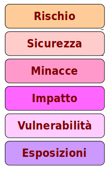

# Il Rischio Informatico

## Terminologia

* **Rischio**
  * Diminuzione di valore degli asset personali, tecnologici o informatici
* **Sicurezza**
  * Grado di successo nell'affrontare il rischio
* **Minacce**
  * Fattori umani, ambientali o tecnologici che mettono in pericolo la sicurezza
* **Vulnerabilità**
  * Utilizzo di HW e SW che è intrinsecamente debole nei confronti di minacce
* **Esposizioni**
  * Configurazioni informatiche o comportamenti umani che accrescono la probabilità di successo delle minacce

## Analisi del Rischio

Il rischio è fondamentalmente la risposta a tre domande di base:

* **Cosa può accadere?**
* **Quanto è probabile?**
* **Quali sono le conseguenze?**

L’analisi del rischio è una disciplina ben stabilita:

* Tecniche di valutazione quantitativa dei valori relativi delle misure protettive
* Coinvolge numerose formule matematiche. Per esempio la più semplice calcola la:
 * Aspettativa Annuale di Perdita - Annual Loss Expectancy (ALE)

Siano:

`e` = valore atteso di un asset tra un anno

`p` = probabilità annuale di perdita

`v` = valore corrente dell’asset

Abbiamo che:

`ALE = e = p v`

### Gestione del Rischio

Obiettivi:

* Identificare i processi aziendali e i loro requisiti IT associati. Stabilire priorità in base alla sensitività e criticalità temporali
* Identificare le minacce ai processi e alle infrastrutture
* Definire strategie per eliminare i rischi e minimizzare gli impatti dei rischi non eliminabili

## Minacce

### Modelli di Minacce

Anche detto **Threat Modelling**, è un approccio strutturato per identificare e quantificare i rischi associati ad un applicativo o servizio.

A seconda della focalizzazione si distingue in:

* **Software** centric
  * Linguaggio di programmazione e sue debolezze
* **Security** centric
  * Rischi e vulnerabilità note
* **Asset** centric
  * Valore dei bersagli degli attacchi

### Classificazione delle Minacce

Tipi:

* Accidentali
* Intenzionali
* Naturali

Aspetti:

* Motivazione dell’attaccante
* Skill dell’attaccante
* Persistenza della Minaccia
  * **Advanced Persistent Threat** (_APT_)
  * **Incompetent Persistent Threat** (_IPT_)

Superfici di attacco:

* Fisiche
* Input
* Reti

Un Incompetent Persistent Threat è la ripetizione continua degli stessi errori da parte del personale utente o amministrativo, senza intenzione di dolo, ma con effetti comunque disastrosi.

### Contromisure alle Minacce

* Sistemi sicuri
  * Intrinsecamente e passivamente sicuri
* Sistemi robusti
  * Resilienza, fault-tolerance
* Interfacce di input limitate
  * Automa a stati finiti
* Sicurezza in profondità
  * Più livelli di difesa
* Sicurezza dinamica
  * Flessibilità temporale di responso agli attacchi
* Sicurezza dei fornitori
  * Componenti HW e SW di terze parti
