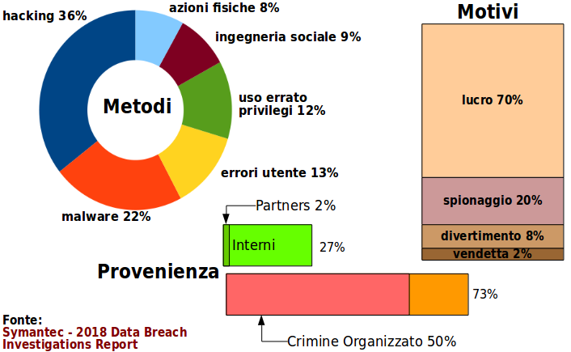
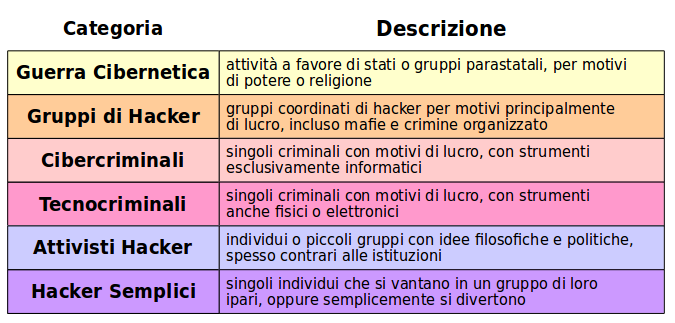

# Situazione Attuale

Lo scenario della sicurezza informatica, il vedere quali sono i tipi di attacchi più _gettonati_, il _trend_ delle attività criminali di moda, descrivono una sitauazione in continuo cambiamento.

Vi sono agenzie statistiche, spesso collegate con ditte di produzione di programmi di sicurezza, che conducono rilievi annuali sulla situazione.

Questi sono di interesse perchè indicano quali sono le principali minacce correnti e dove sia opportuno concentrare gli sforzi di difesa.

In particolare è interessante il rapporto "_Symantec - 2018 Data Breach Investigation Report_" di cui il diagramma riproduce alcune delle conclusioni principali.

La **Provenienza** degli attacchi è al 73% dall'esterno della rete locale aziendale e al 27% dall'interno. La proporzione di attacchi provenienti dall'interno è notevole, ed implica che un certo numero di computer aziendali sono stati inavvertitamente compromessi.

Non è noto se gli impiegati interni siano coinvolti volontariamente in azioni criminose, ma è molto improbabile: quasi sicuramente operano da computer _infetti_.

Circa il 2% degli attacchi provengono da computer di partners aziendali, molto probabilmente perchè la sicurezza dei collegamenti di rete con i partners è rilassata e impropriamente _fidata_.

Circa il 50% degli attacchi, e tutti dall'esterno, sono condotti da crimine organizzato, mafioso o con un paravento di ditte ufficiali. Il loro scopo è il danno monetario a loro vantaggio. Questa è _la_ tipologia di attacchi principali da cui difendersi.

I **Motivi** degli attacchi sono altresì interessanti e vastamente prevedibili. Gli attaccanti principalmente vogliono guadagnarci, con furti o frodi. Questi sono attacchi all'_Integrità_ dei dati. Non è possibile dedurre se si tratti di attaccanti singoli o gruppi.

E' da notare che ben il 20% di attacchi intendano solamente carpire informazioni, ovvero violare la _Confidenzialità_ dei dati. La perccentuale sarebbe molto più alta se fosse possibile includere nell'indagine anche l'attività dei _Servizi Nazionali_, amici o nemici.

Seguono gli _Hacker_ e infine i _Vendicatori_, che sono il pericolo minore in generale. Ma va osservato che a volte i danni causati dai Vendicatori si traducono in un vantaggio competitivo per la concorrenza.

Per quanto riguarda i **Metodi** usati per gli attacchi, questi sono più variegati, e purtroppo indicano che le attenzioni alla difesa devono essere di svariati tipi.

Lo _hacking_ diretto indica lo sfruttamento di debolezze intrinseche dei sistemi informativi, o perchè questi sono vecchi o perchè non aggiornati opportunamente con _patch_ di sicurezza.

Il _malware_ è costituito da programmi che l'attaccante è riuscito ad installare, in qualche modo subdolo, sul computer e lo ha _infettato_. Questo è dovuto spesso a comportamenti impropri dell'utente o a disattenzioni, ed è uno dei motivi perchè è importante la _consapevolezza_ della sicurezza.

L'utente compie anche _errori_ nelle operazioni coi sistemi informativi, che possono essere sfruttati al volo dagli attaccanti. Gli esempi sono innumerevoli, ma uno può subito essere la cattiva gestione delle password.

A volte cattive _configurazioni_ dei sistemi o delle reti permettono ad un attaccante di entrare come utente semplice, poi di condurre una cosiddetta _scalata di privilegi_ e diventare amministratore.

Le persone sono il punto più debole di un sistema informativo, e possono essere direttamente minacciate o indirettamente imbrogliate con attacchi chiamati di _ingegneria sociale_.

Infine la _sicurezza fisica_ dei sistemi non è da ignorare. Accessi non autorizzati ai CED, o furto dei PC portatili del personale possono mettere l'attaccante a diretto contatto con i segreti aziendali.

## Nuova Categorizzazione

E' possibile formulare un nuovo modello di sicurezza, più consono alla situazione presente, che si concentra sulle categorie degli attori non sui dati.

Questo è diverso dal tradizionale _Modello RID_, che rimane comunque valido in discussioni generali della sicurezza informatica.

## Maggiori Pericoli Correnti

Secondo Marc Goodman, esperto di sicurezza ed autore del libro Future Crimes i più probabili sviluppi di sicurezza del 2018 vedranno i seguenti tipi di attacco.

* **Ransomware** - diniego di accesso al computer con richiesta di riscatto in Bitcoin
* **Armi di Intelligenza Artificiale** - riconoscimento delle persone, del loro comportamento, della loro locazione fisica e conseguenti ricatti mirati
* **Attacchi Fisico-Cibernetici** - hacking di aerei, sistemi di trasporto, comunicazioni
* **Furto di Crittovaluta** - Bitcoin principalmente, con attacco ai sistemi che li producono
* **Hacking di Elezioni** - direttamente o con campagne su Siti _Social_
