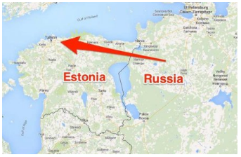
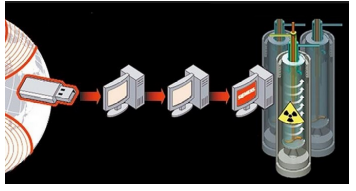
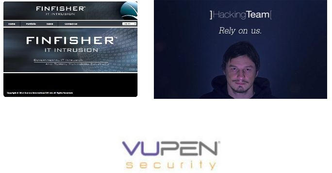

# Cyberwar

Delle sei categorie di attaccanti del _Modello RID_, contro due di esse, _Servizi Nazionali_ e _Nemici/Terroristi_, le singole persone o piccole e medie aziende non si possono efficacemente difendere.

Queste categorie sono impiegate nella Guerra Cibernetica (_Cyberwarfare_) che altri non è che guerra condotta con mezzi informatici, così come il _Cybercrime_ è crimine perpetrato con mezzi informatici.

Nonostante l'impotenza privata, questo aspetto della sicurezza informatica non si può ignorare, perchè sta già apportando conseguenze allo scenario di sicurezza globale attuale, e molto più gravi può apportarne in futuro.

Fortunatamente al momento si tratta di **guerra fredda**, che vede principalmente raccolta di informazioni, ovvero spionaggio), e propaganda, per esempio manipolazione dei siti _social_.

In caso di escalation a **guerra calda**, come ormai avviene su molti teatri limitati nel mondo, la sicurezza cibernetica assume un ruolo chiave nell'intera dominanza del campo delle operazioni, e nelle strette interazioni tra informatica e proiettili fisici, la cosiddetta _Guerra Mista_: sia attacchi fisici a infrastrutture informatiche, che attacchi informatici i quali causano danni fisici.

## SCADA

E' inoltre in atto il tentativo di guadagnare il controllo delle _Infrastrutture Critiche_ civili del potenziale nemico remoto, come centrali di comunicazione, erogazione energia, distribuzione materiali, nodi decisionali. 
Queste infrastrutture vanno sotto la sigla **SCADA** (_Supervisionary Control And Data Acquisition_ - Controllo di Supervisione ed Acquisizione Dati).

I compito di _SCADA_ sono:

* Monitoraggio e controllo di sistemi fisici industriali
* Controllo di produzione
* Erogazione energia, acqua, ecc.
* Controllo delle centrali nucleari
* Controllo della rete Internet

In caso di attacco _cyberwar_ vi sarebbero conseguenze su:

* Popolazione civile colpita, non direttamente, ma per l'assenza di servizi di base
* Difficoltà di recupero manuale delle operazioni se i computer non funzionano più
* Assenza di sistemi di salvataggio dati

### Esempio: Attacco all’Estonia

All’uscita dal comunismo l’Estonia si è totalmente informatizzata (Governo Elettronico, Banking Online, ecc.)
Nel giugno 2006 in Estonia abbattono il monumento al milite ignoto sovietico, considerato non estetico ed un retaggio del passato.

Per vendetta il KGB inizia un attacco continuato di _Indisponibilità di Servizio_.
L’attacco dura molti giorni poi cala e termina.

In questo periodo l’Estonia è completamente paralizzata: banche, scuole, sanità non funzionano più.
Il danno stimato è di centinaia di milioni di euro.

L’attacco consisteva in enormi quantità di traffico di rete per saturare i computer della nazione vittima.

Il KGB non ha mai assunto resposabilità per l’attacco, condotto apparentemente da singoli cittadini russi come ripicca all'abbattimento di una statua.

Israele ha cooperato con l’Estonia per l’innalzamento di nuove barriere difensive cibernetiche.

### Esempio: Stuxnet

Nel 2009 l’Iran ha un impianto sotterraneo di arricchimento dell’uranio con centrifughe della ditta Siemens, che potenzialmente possono produrre materiale per armi atomiche.

Forse gli Stati Uniti e forse con l'appoggio di Israele sviluppano un virus avanzato, **Stuxnet**, per l’attacco a questi sistemi SCADA.

Il virus è posto in una chiave USB e tirato con una fionda oltre il recinto dell’impianto. Qualche operaio nell’ora d’aria lo raccoglie e lo prova sul suo PC.

Dopo poche ore utte le centrifughe Siemens aumentano a dismisura i giri esplodono, con molte vittime tra il personale (mai confermate dall'Iran).

Per molti altri anni Stuxnet è scoperto su PC in molti paesi nel mondo, tra le nazioni che cooperavano con l'Iran, quali Russia e Cina.

Il software dei macchinari industriali, e di _Internet of Things_ in generale, ha molte meno protezioni di sicurezza dei normali Server e PC.

Ma questi macchinari controllano la produzione e distribuzione dell’energia, i treni e gli aerei, le comunicazioni globali e la produzione industriale.

Si sta velocemente arrivando a un nuovo mondo, molto pericoloso.

## Gli Attori nel Cyberwar

Il budget principale noto è quello della _National Security Agency_ (NSA) americana, con la sede del _Cybercommand_ in Virginia e molti siti, soprattutto di _SuperUltraComputer_ in località meno note. L'ultimo sito sospetto costruito, nello Utah, è sotterraneo e con superficie stimata pari a sei campi di calcio.

Altre nazioni strettamente alleate dell'America che condividono le informazioni acquisite, sono la _Five Eyes Alliance_ (Alleanza dei Cinque Occhi), includenti la Gran Bretagna, Canada, Australia e Nuova Zelanda.

Una cooperazione parziale proviene dagli stati membri della NATO, incluso l'Italia, e da Israele.

In Cina si occupa di _cyberwar_ il terzo dipartimento dell'Esercito di Liberazione del Popolo (3PLA - _People's Liberation Army_), con elevata reputazione di competenza ed efficacia. Grazie all'integrazione stretta con l'industria ed ogni altro settore, si ritiene che la Cina sia la nazione più preparata alla _guerra cibernetica calda_.

La Russia tramite i suoi Servizi Segreti ha ormai acquisito una competenza sul campo in numerose operazioni _cyberwar_ limitate, come ad esempio l'attacco di successo all'Estonia nel giugno 2006.

Molti paesi arabi, e in particolare l'Iran, hanno le risorse monetarie ed intellettuali necessarie, ma non possono apertamente ottenere il materiale informatico d'avanguardia necessario.

Anche l'India viene ritenuta un attore rilevante, ed infatti in questo paese sono stat osservati _virus_ innovativi e traffico di rete inconsueto.

## Operazioni Correnti

Queste sono diventate note tramite le rivelazioni di _Wikileaks_ e di alcuni intraprendenti 'spifferai' intorno agli anni 2010. Le agenzie segrete mondiali hanno in seguito fortemente tappato i canali da cui uscivano le notizie.

Il Regno Unito (**GCHQ** - _Government Communications Head Quarters_) già da più anni intercetta tutto il traffico di rete dei sudditi di Sua Maestà e tutto il traffico dei cavi sottomarini passanti per la Cornovaglia. Dopo l'appliaczione di filtri di rilevanza, il traffico _interessante_ ha periodi di ritenzione di 30 anni. I programmi di analisi del traffico inglesi sono addirittura molto più efficaci di quelli americani, tanto che questi ultimi se ne servono.

Lo **NSA** _National Security Agency_ americano controlla politicamente il _National Institute of Standards and Technology_ (NIST) ed ha effettivamente imposto l'adozione di standard di crittografia _bacati_ e decifrabili. Questo copre, ad esempio, lo standard SSL/TLS che si usa per le operazioni di _Home Banking_ in tutto il mondo.

Lo NSA ha il dipartimento di _Tailored Access Operations_ (TOA) - Operazioni di Accesso Calibrate, con cui le agenzie di servizi informativi ed esecutivi militari e civili americane (CIA ed altre) possono contare su operazioni hacker _ad hoc_ e strumenti sofisticati di _cyberwar_ da campo.

Gli Stati Uniti hanno inoltre attivo il progetto **Prism** che consiste nel tentativo di raccolta di tutte le comunicazioni Internet al mondo e della loro ritenzione per i prossimi 100 anni. Sono aiutati in questo dal piazzamento di hardware di intercettazione nei luoghi strategici ove passa la maggior parte del traffico.

Tutte la maggiori forniture di materiale informatico americano destinate all'export sono modificate alla fabbrica e includono dispositivi hardware a bordo per l'inercettazione dati e il controllo dei dispositivi.

Quasi sicuramente molto materiale elettronico esportato dalla Cina (telecamere di sorveglianza e gli smartphone _Huawei_) sono potenzialmente sotto il controllo del 3PLA.

Si può tranquillamente affermare che a livello militare globale, semplicemente **la privacy non esiste**.

In particolare in Italia, tutto il traffico telefonico e Internet è passato d'ufficio allo NSA, la quale agenzia **non** ne rende partecipe le autorità giudiziarie italiane.

## Attori Privati

Un numero elevatissimo (migliaia) di ditte private mondiali offrono a pagamento _dispositivi di intercettazione e di hackeraggio_ dei dati di vittime terze, e addirittura interi _servizi chiavi in mano_ per lo hackeraggio.

Una lista molto parziale include:

* **Gamma** (inglese), autori del _malware_ **FinFisher** per lo spionaggio e il controllo dei computer
* **Hacker Team** (italiana), con servizi completi di spionaggio, di cui apparentemente è cliente anche la Polizia di Stato
* **Vupen** (francese) specialisti in cosiddetti _Zero Day Expoits_ (attacchi del giorno zero) cioè _virus_ per cui non è ancora stata sviluppata una difesa

I clienti sono soprattutto governi autoritari dei paesi del terzo mondo che persegono dissidenti espatriati.

Il volume globale d'affari si sta rapidamente avvicinando a quello delle armi portatili.

## Considerazioni

Non vale la pena per il privato cittadino, e neache per ditte fino a medio-grandi, tentare di difendersi o adottare contromisure in campo _cyberwarfare_.

Possono però avvenire _incidenti_ futuri, di portata anche mondiale, che sono diretto risultato di queste attività.

E' possibile che venga repentinamente a mancare il collegamento Internet, anche per periodi prolungati. E' immaginabile anche un _blackout_ elettrico di svariati giorni.

Sarebbe opportuno che a livello di autorità civili, e anche a livello individuale, si pianificasse il comportamento in tali eventualità.
