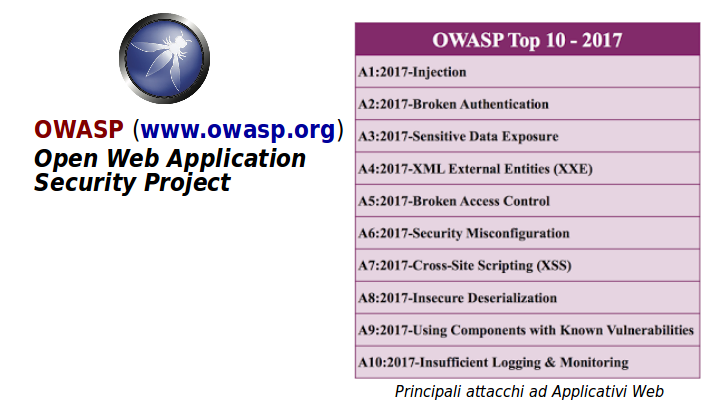

# Vulnerabilità ed Esposizioni

Sono i due aspetti che determinano le debolezze del software e dei sistemi.

* **Vulnerabilità**
  * Errore del software che può essere direttamente usato da uno hacker per avere accesso a sistemi o reti
    * Sia programmi che protocolli di rete
    * Non tutte sono state scoperte
    * Non tutte è possibile correggerle

* **Esposizione**
  * Errore di configurazione o di utilizzo del software che permette l'accesso a informazioni o l'utilizzo di capacità tali da facilitare ad uno hacker l'accesso a sistemi o reti.
    * Configurazioni di default o di esempio
    * Mancata comprensione dei rischi

## Common Vulnerabilities and Exposures

E’ un catalogo che lista tutte le debolezze del software e dei sistemi scoperte finora.

Usa identificativi standard: **CVE-anno-numero**

Esempio: `CVE-2017-11882`

* Usati da tools come _Metasploit_ e vari _Vulnerability Scanners_
* Aiutato da molti collaboratori
* In cooperazione con US National Vulnerability Database
* Mantiene una lista di tutte le vulnerabilità storiche identificate

## Problemi con i Linguaggi Software

Viene spesso asserito che il linguaggio di programmazione usato è la causa principale degli errori del software. Vi sono dei _pro_ e dei _contro_ relativi a questa asserzione.

* Pro: alcuni linguaggi hanno davvero debolezze proprie
  * Buffer overflows: C
  * Memory leaks: C++, NodeJs
  * Type problems: JavaScript

* Contro: in realtà dipende molto dalle tecniche di sviluppo
  * Semplicità e comprensibilità del codice
  * Approccio Test Driven Development
  * Visibilità del codice sorgente

Nella scelta dei programmi è utile avvalersi delle seguenti discriminanti positive, che danno una garanzia sulla _bontà_ del codice:

* Il codice è consultabile su GitHub
* La comunità d’interesse è vasta
* Le modifiche sono recenti

## Vulnerabilità: OWASP Top 10

Questa è una lista di vulnerabilità più comuni degli applicativi basati su Web.

* Trend corrente
* Aggiornato ogni qualche anno
* Non è esaustivo: sono le sole vulnerabilità principali

Molti strumenti di _Penetration Testing_ si concentrano ad attaccare queste vulnerabilità specifiche.
