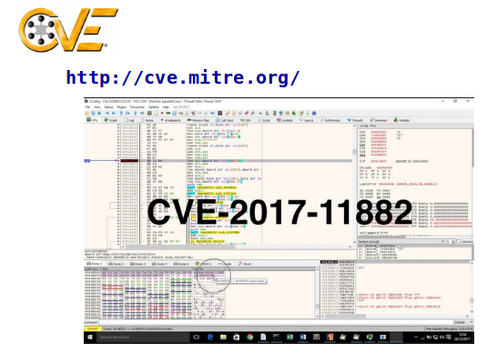
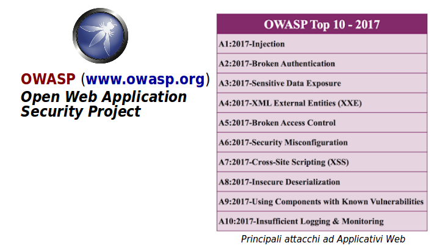

# Vulnerabilità ed Esposizioni

Sorge evidentemente la domanda di come e perchè i sistemi informativi siano attaccabili con successo.

I motivi sono sia storici che circostanziali.

## Componenti Informatiche Deboli

### Protocolli di Rete

I **protocolli di rete** Internet che stiamo usando tuttora, cioè la combinazione di _struttura_ dei dati interscambiati e le _regole_ di interscambio, sono molto deboli per la sicurezza.

Per esempio i _pacchetti_ dati che transitano non hanno alcun modo di garantire che l'indirizzo del mittente sia vero.

Tali protocolli datano dagli anni '70 e sono stati concepiti per un ambiente accademico e o militare in cui l'accesso fisico ai dispositivi di calcolo era protetto, e solo grandi organizzazioni li possedevano.

Le prime avvisaglie di programmi malefici sono avvenute alla fine degli anni '80. Poi nel corso degli anni '90 abbiamo assistito all'_esplosione_ dell'utilizzo di Internet anche con Personal Computer. Questo ha portato alla nascita e sviluppo dei criminali informatici.

Esistono protocolli alternativi e più sicuri, come ad esempio _IPSec_, almeno dal 1995. La loro adozione è stata inizialmente osteggiata da ditte IT commerciali come la Microsoft, ed ora la loro introduzione è improponib la sostituzione di miliardi di computer esistenti.

### Linguaggi di Programmazione

I **linguaggi di programmazione** hanno notevolissimi difetti di sicurezza, in paricolare il **Linguaggio C** (dal 1969-1975), il *Linguaggio C++** (dal 1986) e il **Linguaggio Java** (dal 1996). Questi da soli coprono l'80% dei programmi client-server esistenti. E non sono i soli linguaggi ad avere problemi di sicurezza.

In particolare nella programmazione di applicativi web è vastamente usato il **JavaScript** che dal punto di vista della sicurezza e senza infierire, lo si potrebbe tranquillamente definire un _colabrodo_.

Ci sono linguaggi nuovi e molto più sicuri, per esempio **Go** e soprattutto **Rust**, ma il loro uso richiederebbe, oltre a una vera presa di posizione positiva, il riaddestramento di milioni di programmatori.

### Sistemi Operativi

I **sistemi operativi** hanno problemi di sicurezza che vengono scoperti, e a dire il giusto riparati, in continuazione. Alcuni hanno un'architettura di base francamente obsoleta e forse irrecuperabile, come **Windows** e in minor misura **MacOS**. L'unico che può evolversi efficacemente per far fronte alle sfide di sicurezza è **Linux**, più altri sistemi _Unix_ e **Open Source** come **OpenBSD** e **FreeBSD**.

Il fatto che molto software di base sia **Open Source** non vuol però dire che l'utente si compili a casa la sua versione: richiederebbe giorni (è stato proposto con **Gentoo**). Però il distributore della versione già compilata può surrettiziamente includere programmi non previsti (è successo in passato con Linux **Ubuntu**).

### Programmi Eseguibili

I **programmi eseguibili** sono quelli che compiono operazioni utili e desiderabili, il vero motivo di esistenza dell'informatica. I programmi hanno numerose debolezze e veri e propri _bachi_, cioè comportamento diverso dalle specifiche di progetto, in determinate circostanze.

I programmi commerciali sono scritti da _squadre_ o raramente da individui, secondo i dettami e le pratiche di **Progetti Software**. In passato ed anche in alcuni casi patologici presenti, la conduzione di un progetto sofware seguiva schemi rigidi, burocratici e tutt'altro che favorevoli alla rapida scoperta e correzione di errori.

Anzichè la disciplina del _testing continuativo_, che ha un costo, è invalsa la pratica del _workaround_ (pezza, accrocchio) ai problemi scoperti tardivamente.

Le moderne pratiche di sviluppo software, _agili_ e basate su filosofie _collaborative_, stanno fortunatamente prendendo sempre più piede. Ma non tutti i produttori di software hanno come priorità la _qualità_ del prodotto, nella fretta soprattutto di arrivare per primi sul mercato.

Un grosso problema storico è che possediamo molto software già scritto, senza più i sorgenti originali e senza più gli sviluppatori originali: è il cosiddetto codice **legacy**. Riscriverlo da zero è dispendioso di risorse. Non riscriverlo è un pio desiderio che non abbia problemi di sicurezza.

Inoltre molto software fà uso di **librerie**, componenti modulari sviluppati da terzi e inclusi passivamente dal programmatore. Quasi sempre queste librerie sono **firmware**, cioè di controllo diretto di dispositivi fisici, e il loro contenuto è incomprensibile e segreto. Molti episodi recenti hanno rilevato seri problemi di sicurezza in librerie molto usate.

Infine non è da scartare la possibilità che codice malefico possa venire inserito direttamente e di nascosto dal programmatore stesso, che è nel profondo dell'animo uno _hacker_. Molti programmi anche famosi contengono già **uova di pasqua**, effetti divertenti e scherzosi. Nulla avrebbe impedito l'inserimento di _malware_.

## Definizioni

Vengono distinti due tipi di debolezze dei sistemi informativi per quanto riguarda la sicurezza. Questa separazione è molto importante per impostare l'approccio difensivo.

### Vulnerabilità

Una **vulnerabilità** è un errore del software - programma, sistema operativo, linguaggio o protocollo - che può essere direttamente usato da uno hacker per avere accesso a sistemi o reti.

* Sia nei programmi che nei protocolli di rete
* Non tutte sono state scoperte
* Non tutte è possibile correggerle

Una _vulnerabilità_ e un _baco_ sono differenti: un baco produce un comportamento non previsto dalle specifiche mentre in presenza di una vulnerabilità il programma (o protocollo, ecc.) può comportarsi perfettamente.

Una vulnerabilità coinvolge la sicurezza e dà all'attaccante la possibilità di sovvertire il software e compromettere una combinazione di _Confidenzialità_, _Integrità_ e _disponibilità_.

Le vulnerabilità non sono state progettate nel software, così come non lo sono i bachi, almeno se abbiamo la presunzione necessaria dell'onestà del programmatore.

Le vulnerabilità vengono scoperte quasi sempre dall'ingegno e dall'immaginazione creativa dello hacker o di un altro programmatore.

Finchè il codice non venga modificato in modo da riparare la vulnerabilità, e finchè il codice con le correzioni non viene installato su tutte le macchine coinvolte, abbiamo una situazione detta **Zero Day Vulnerability** (Vulnerabilità del Giorno Zero) e le macchine sono, come dice la parola, _vulnerabili_.

Scoprire una vulnerabilità implica anche scoprire il modo di sfruttarla maleficamente con un cosiddetto **Exploit** (da pronunciarsi all'inglese e non alla francese).

Deontologicamente, il programmatore che scopre una nuova vulnerabilità dovrebbe comunicarla alla ditta produttrice del software, che dovrebbe dimostrare riconoscimento almeno verbale. Non sempre accade così.

Inoltre il programmatore disonesto che scopre una nuova vulnerabilità ha anche la posssibilità di venderla in appositi circuiti criminali.

### Esposizione

Un'**esposizione** è un errore di configurazione o di utilizzo del software che permette l'accesso a informazioni o l'utilizzo di capacità tali da facilitare ad uno hacker l'accesso a sistemi o reti.

A differenza di una _vulnerabilità_, qui il software funziona perfettamente anche dal punto di vista della sicurezza. E' l'uso che se ne fà che crea il pericolo.

Le _esposizioni_ provengono da:

* **cattive configurazioni** - colpa dell'_amministratore_
  * Esempi: configurazioni di default o di esempio, settaggi di fabbrica non modificati, ecc.
* **uso improprio** - colpa dell'_utente_
  Esempi: la stessa password su più computer, troppi permessi ai file, login come amministratore, ecc.

Una similitudine automobilistica: guidare una Panda anzichè una Mercedes dà maggiore _vulnerabilità_ negli incidenti, guidare un'auto qualsiasi in Inghilterra a destra dà maggiore _esposizione_ agli incidenti.

Per presunzione di innocenza, le _esposizioni_ sono sempre colpose, mai dolose - ma possono essere di grave impatto per la sicurezza come le _vulnerabilità_. Una combinazione delle due può veramente essere fatale.

Le _esposizioni_, sia da parte dell'amministratore che dell'utente, sono dovute a:

* ignoranza dei rischi che si corrono
* superficialità nell'affrontare i rischi
* disattenzione nel compiere operazioni

A parte un sano addestramento contro pratiche pericolose, non si possono efficacemente combattere le esposizioni. Il proverbio latino dice che "Contro la stupidità anche gli stessi dei lottano invano".

## Cataloghi e Scansioni

### CVE

Così come esistono cataloghi di stelle, esistono cataloghi di tutte le _Vulnerabilità_ ed _Esposizioni_ che sono state scoperte.

Di gran lunga il più diffuso di tali cataloghi è il **Common Vulnerabilities and Exposures** (CVE), mantenuto dalla _Mitre Corporation_ col contributo attivo e sponsorizzazione del governo americano.

Si tratta di un registro di protocollo ove ogni vulnerabilità od esposizione è registrata con la sigla **CVE-_anno_-_sequenza_**, cioè con l'anno di registrazione e un numero di protocollo sequenziale in quell'anno.

Un esempio può essere: `CVE-2017-11882`.

Sono quindi forniti dettagli sotto forma di scheda:

* sintomi della vulnerabilità o esposizione
* sistemi o programmi coinvolti
* possibilità di sfruttamento
* conseguenze di un _exploit_ di successo
* riferimenti alle _patch_ disponibili per ovviarvi

Il catalogo CVE non dà mai informazioni su come sfruttare una vulnerabilità, ne riferimenti ai programmi di attacco.

Sono inoltre catalogate le V&E solo se esiste un _antidoto_, sotto forma di _patch_ o programmi correttivi. Non compaiono mai _Zero Day Vulnerabilities_.

Il Catalogo CVE contiene molte decine di migliaia di record.

### Scansioni di Vulnerabilità

Esistono programmi sia commerciali che _free_, simili ad antivirus, per la scansione dei sistemi alla ricerca di _Vulnerabilità_ ed _Esposizioni_. Questi includono tipicamente tutto il Catalogo CVE.

E' buona norma sottoporre i sistemi aziendali ad una scansione di vulnerabilità, specialmente i server e gli altri computer che devono accedere direttamente ad Internet.

Evidentemente in seguito alla scoperta di vulnerabilità, occorre valutare l'_impatto_ di un conseguente sfruttamento di successo, ed applicare il software correttivo appropriato, o staccare il computer dalla rete.

### Penetration Testing

Le _scansioni di vulnerabilità_ sono parte di una attività complessa di _auditing_ o verifica della sicurezza dei sistemi e degli applicativi in produzione, detta **Penetration Testing** (_PenTest_) - Test di Penetrazione.

Questo è un testing di carattere estremo, solitamente affidato ad una squadra di esperti certificati, a contratto.

La squadra cerca di violare i programmi ed i sistemi con gli stessi _strumenti e metodi_ che un vero criminale userebbe e, se vengono scoperte vulnerabilità, produce un rapporto dettagliato per permetterne il contrasto.

Ovviamente la squadra di _PenTest_ non causa alcun danno, solamente ne esplora le possibilità.

Il personale - utenti e amministratori - di solito non è a conoscenza del _PenTest_, se si intende avere una fotografia realistica delle condizioni di sicurezza in opera.

## OWASP Top 10

In Internet la stragrande maggioranza di applicativi usano il Web. Il _World Wide Web_ è un servizio client-server basato sul protocollo HTTP e derivati - _Hyper Text Transfer Protocol_, Protocollo di Trasferimento Ipertestuale.

I siti web possono essere **statici**, che trasferiscono solamente pagine preparate in precedenza, o **dinamici**, che generano le pagine da trasferire sull'istante, in seguito ad interazione con l'utente.

Mentre i siti statici sono molto sicuri, ma per niente interattivi, i siti dinamici hanno un numero molto elevato di _vulnerabilità_ ed _esposizioni_.

Esiste un ente in Internet che mantiene una lista, a intervalli di qualche anno, delle vulnerabilità web più sfruttate, la **Top 10 List** - lista delle prime 10.

L'ente è **OWASP** - _Open Web Application Security Project_, e la lista correntemente in vigore è del 2017. Le vulnerabilità sono elencate in ordine di impatto decrescente, la più pericolosa per prima.
La lista è descritta in modo più approfondito in un successivo modulo.

E' una lista soprattutto di interesse ai programmatori di Applicativi Web, che devono inserire nei loro programmi opportune contromisure difensive.

Molti siti web sono vulnerabili per l'inesperienza dei programmatori, dovuta al fatto che c'è un costo globale di produzione dei siti dinamici, di cui una grossa proporzione è il compenso ai programmatori.

Ma esistono anche, volutamente, dei **siti malefici**, che danneggiano l'utente che li frequenta e che ne compromettono la privacy, possono compiere un furto d'identità, agiscono in modo improprio e spesso ignoto sul computer stesso dell'utente.

I programmi **scansori di vulnerabilità**, quando esaminano siti web, si concentrano soprattutto sulle _OWASP Top 10_.
