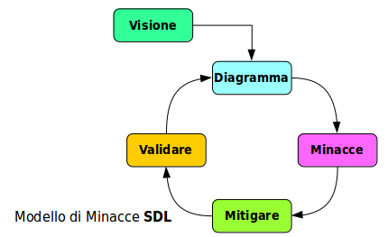

# Il Rischio Informatico

La sicurezza si può dividere in:

* Sicurezza **fisica**
  * Protezione delle _persone_
  * Protezione dei _beni_
* Sicurezza **informatica**
  * Protezione dei _dati_
  * Protezione dei _processi_

La sicurezza non è mai assoluta, sia essa fisica che informatica. Esistono sempre rischi di perdita o degrado.

I rischi però possono essere stimati, calcolati, eliminati, ridotti o gestiti. Per farlo occorre esserne consapevoli e adottare opportuni accorgimenti.

## Definizioni

La **definizione** di rischio dipende alquanto dalla disciplina a cui ci si riferisce. Esiste il rischio fisico, finanziario, sanitario, ...

Le definizioni che seguono sono calate nell'ambito della sicurezza informatica.

### Rischio

In generale il rischio è una possibile perdita di valore degli _asset_ posseduti. In informatica gli _asset_ sono costituiti da:

* **dati**
  * personali, attuariali, finanziari, di proprietà intellettuale, di reputazione, ecc.
* **processi**
  * che producono un ritorno di valore per le persone coinvolte, e che nel nostro caso impiegano mezzi informatici

Il _valore_ dei dati e dei processi può essere palese oppure intangibile, con tutto uno spettro di possibilità intermedie, ma viene sempre tendenzialmente _monetarizzato_ per essere inserito in formule matematiche.

La teoria generale del rischio è ben consolidata è ha un forte fondamento matematico.

### Sicurezza

E' l'insieme di strumenti e procedure che vengono usati per affrontare il _rischio_, impedendo o contenendo la perdita di valore, ed il loro grado di successo.

### Minacce

Eventi, situazioni e fattori - umani, ambientali o tecnologici - che si oppongono alla sicurezza.

Tra loro contiamo le _vulnerabilità_ e le _esposizioni_.

Le minacce vanno enumerate e riconosciute per ogni caso specifico. Uno smartphone non ha le stesse minacce di un server di stampa.

### Impatto

Conseguenze della realizzazione delle _minacce_, che possono andare dalle minori alle catastrofiche.

E' opportuno definire una **soglia di accettabilità**, al di sotto della quale l'impatto può essere ignorato. Per esempio rovesciare il caffè sulla tastiera.

E' anche necessario definire una **soglia di disastro**, al di sopra della quale il regime di produzione e i comportamenti di recupero sono totalmente diversi. Per esempio la perdita totale del database aziendale principale.

## Analisi del Rischio

Consiste nell'esaminare le minacce, la loro possibilità e probabilità, e la conseguenza sul valore degli _asset_ qualora si verifichino.

Vi sono molte metodologie di _analisi del rischio_, che ultimamente tentano di rispondere alle tre domande:

* Cosa può accadere?
* Quanto è probabile?
* Quali sono le conseguenze?

### Modelli di Minacce

In ambito di sicurezza informatica l'_analisi del rischio_ si ottiene spesso formulando **modelli decisionali** con componente sia descrittiva che matematica, in una attività detta **Threat Modelling** ovvero modellazione delle minacce.

Questa può essere focalizzata su:

* **software** - debolezze dei linguaggi di programmazione e degli applicativi
* **processi** - debolezze nell'impostazione e utilizzo delle procedure informatiche sul campo
* **asset** - valore dei dati e dei processi a rischio

Le minacce vengono tipicamente classsificate in:

* **naturali** - eventi ambientali di maggiore o minore diffusione o intensità
* **accidentali** - dovute ad errori di una o più componenti del complesso sistema informativo
* **intenzionali** - con dolo e malizia da parte di _attaccanti_

Le ultime sono quelle di particolare interesse per la sicurezza informatica. Nel loro caso vengono quindi considerati:

* la **motivazione** dell'attaccante
* la **competenza** dell'attaccante
* la **persistenza** temporale della minaccia

Per quanto riguarda la _persistenza_, due casi estremi hanno sigle specifiche:

* **Advanced Persistent Threat** (APT) - Minaccia Persistente Avanzata
  * E' una minaccia complessa, continuativa, pericolosa. E' spesso perpetrata da criminali o gruppi criminali esperti e con risorse, ed ha una elevata probabilità di successo.
* **Incompetent Persistent Threat** (IPT) - Minaccia Persistente Incompetente
  * La minaccia deriva da errori fondamentali nei sistemi o nelle procedure, non riconosciuti e quasi sempre colpa degli amministratori, degli utenti o della stessa _progettazione_

Un buon _Modello di Minacce_ identifica anche da dove possono provenire gli attacchi e quali sono i componenti del sistema informativo che possono venire attaccati. Definisce cioè la **Superficie d'Attacco** (_Attack Surface_).

Questa può consistere in:

* locazioni fisiche non protette adeguatamente
* input errato o malefico
* sistemi interni che vengono compromessi
* reti fisiche
* protocolli di rete
* ecc.

## Gestione del Rischio

La sicurezza _è_ la gestione del rischio.

In seguito a studi psicologici sono state identificate **percezioni** diverse del rischio, con conseguenti diverse **posture** nell'affrontarlo.

Alcune frasi e asserzioni che si incontrano, denotano come la realtà del rischio sia mal percepita:

* _"Sono tutte storie scandalistiche"_ - diniego del rischio, mancanza di consapevolezza
* _"Non ci si può fare niente, comunque"_ - rassegnazione, nascondere la testa sotto la sabbia
* _"Non capiterà a me"_ - assunzione di invulnerabilità, fuori dal mondo
* _"Non abbiamo mai avuto problemi"_ - mancanza totale di monitoraggio, probabile presenza di enormi problemi

La corretta _gestione del rischio_ passa da alcune fasi ben definite:

* **Analisi del Rischio**
  * identificare le _vulnerabilità_ ed _esposizioni_
  * approntare un _Modello delle Minacce_
* **Eliminazione del Rischio**
  * molte minacce sono semplicemente eliminabili, p.es. non attivare programmi che non servono, non esporre alla rete macchine deboli, ...
* **Mitigazione del Rischio**
  * adozione di tutte le contromisure che rendono le _minacce_ meno probabili
  * antivirus, firewall, addestramento del personale, ...
* **Riduzione dell'Impatto**
  * il rischio non eliminabile (residuo) va accettato
  * occorre impedire una eccessiva perdita di valore qualora si verifichi

L'ultima fase consiste nello **Sviluppo di Obiettivi Specifici** per la continuità dei processi aziendali anche in caso di eventi catastrofici. Alcune sottofasi rilevanti sono:

* Sistemi e Procedure di Prevenzione Disastri
* Piani di Recupero da Disastri (_Disaster Recovery Plans_)
