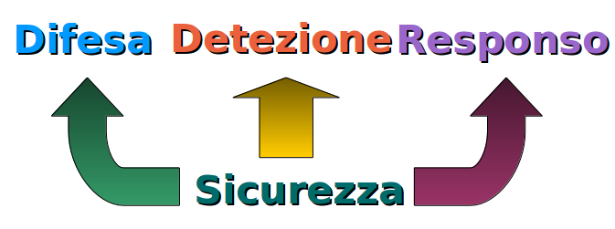
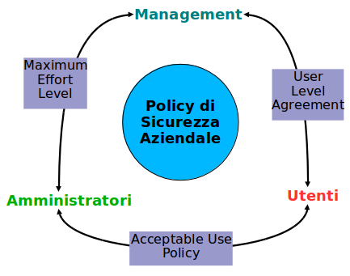

# La Difesa

Non esiste una formula unica e globale per definire la difesa da attacchi informatici.

Vi sono però alcuni principi _strategici_ di base per l'impostazione di una difesa efficace.

## Modello a Forchetta

La difesa globale dei sistemi può essere rappresentata da una forchetta a tre punte:

* **Difesa** - opporre resistenza agli attacchi
* **Detezione** - accorgersi degli attacchi in corso
* **Responso** - contrastare gli attacchi

### Difesa

#### Difesa Passiva

Consiste nell'applicare le **migliori pratiche** (_best practices_) di ingegneria informatica:

* firewalls e filtraggio pacchetti
* impedire il collegamento comunicativo diretto fra l'interno e l'esterno di una rete
* corrette procedure di salvataggio_ e _ripristino_ dei dati
* autenticazioni multifattore
* permessi minimi per il lavoro da svolgere
* uso pervasivo di comunicazioni crittografate
* difesa fisica dei sistemi
* eliminazione dei servizi inutili
* limitazione della diffusione delle informazioni

#### Difesa in Profondità

I sistemi sono difesi a più livelli con suddivisione delle reti interne e firewall personali su ogni computer.

#### Difesa Dinamica

I sistemi non sono costantemente sotto attacco, ma lo possono divenire in qualsiasi momento. La difesa consiste di **profili di difesa**, a livelli differenti, con la possibilità di passare rapidamente da un profilo all'altro.

Si va da una situazione _rilassata_ in cui il lavoro è normale, ad una elevazione della sicurezza con limitazioni al lavoro possibile, ad eventualmente un livello massimo con distacco dalla rete e cessazione temporanea del lavoro.

### Detezione

Molti attacchi informatici sono noti (dal Catalogo CVE per esempio) e hanno **segnature** specifiche, cioè pacchetti software particolari, sequenze particolari schemi riconoscibili.

Esiste software che è in grado di riconoscere queste _segnature_, gli **Intrusion Detection Systems** (IDS) - Sistemi di Detezione Intrusioni.

Questi sono di due tipi principali:

* **Net IDS** (N-IDS) - monitorizzano attività sospette sulla rete
* **Host IDS** (H-IDS) - monitorizzano attività sospette sui singoli computer

Le attività avvengono di solito in simultanea su parecchi computer e in più luoghi della rete. Uno IDS è quindi costituito da più **sonde** che raccolgono i dati anomali, che comunicano con una **console di controllo**.

Quest'ultima analizza i dati sospetti, conduce correlazioni, consulta basi di dati di vulnerabilità, ed eventualmente allerta il personale o il sistema di _responso_.

### Responso

Tipicamente deve essere identificato ed adeguatamente incaricato del personale che si occupa di **Incident Response** - Responso agli Incidenti.

La squadra di responso deve avere l'autorità per intraprendere azioni contrastive agli attacchi, anche a costo di ridurre la produttività aziendale.

Devono essere preventivamente identificati **scenari di responso** che elencano le azioni da eseguire.

Devono essere condotti test a intervalli regolari per assicurasi della efficacia delle azioni di responso.

## Addestramento del Personale

Il miglior sistema tecnologico di difesa informatica non è valido se il personale non è addestrato ad usarlo.

Inoltre molte _esposizioni_ dipendono da comportamenti del personale che sono forse accettabili su PC personali, ma non sicuramente durante l'utilizzo dei sistemi informativi aziendali.

E' necessario che esista un documento esplicito di **Policy di Sicurezza**, che indichi:

* le azioni non concesse
* il monitoraggio in essere
* i responsabili esecutivi
* le penalità per trasgressioni

E' necessaria una **campagna di addestramento** per il personale che:

* permetta di acquisire consapevolezza sui problemi di sicurezza
* descriva i pericoli e le contromisure
* indichi e motivi le pratiche pericolose
* si assicuri della ricezione delle informazioni fornite

## Pratica della Sicurezza

### Considerazioni Generali

Acquisire consapevolezza dei problemi di sicurezza significa avere:

* Policy di Sicurezza aziendale
* Personale addetto alla sicurezza
* Addestramento contro pratiche pericolose

I reequisiti minimi sono ben noti: Antivirus e Firewall.

Ma significa anche:

* Compiere una blindatura dei server esterni
* Porre in ssolamento le macchine deboli
* Progettare piani di _Recupero da Disastri_

#### Blindatura dei Server

* Eliminare tutti i servizi inutili
* Aggiornare le correzioni di sicurezza dei servizi in uso
* Non usare mai autenticazioni in chiaro
* Non fidarsi mai della sicurezza dei protocolli di rete a basso livello: i controlli di sicurezza li compiono i programmi applicativi
* Aumentare la Registrazione delle attività (log)
* Usare sempre solo canali di comunicazione crittografati

#### Policy di Sicurezza Aziendale

In una buona Policy di Sicurezza vi sono tre partecipanti:

* Management
* Utenti
* Amministratori

e documenti formali che esprimono i diritti e doveri di ciascuna coppia di loro.

Il documento di Policy di Sicurezza Aziendale deve essere redatto, mantenuto ed osservato rigorosamente dal personale.

#### Cura dei Personal Computer

I Personal Computer sono macchine relativamente deboli.

Pochi accorgimenti influiscono molto sulla sicurezza:

* Usare solo PC e Sistemi Operativi moderni - quelli del passato anche recente non sono più mantenuti aggiornati dai produttori
* Mantenere il Sistema Operativo aggiornato
* Proteggere l’accesso con password solide e cambiarle con regolarità
* Non rivelare mai le password ad altri, anche se fidati
* Non collegarsi come Amministratore - programmi malefici installati a nostra insaputa possono causare gravi danni
* Compiere regolari salvataggi e provarne anche il recupero
* Crittografare il disco fisso - se il PC è rubato le informazioni contenute rimangono riservate

#### Pericoli della Posta Elettronica

> La Spam è l’equivalente inglese della carne Manzotin.
Il significato di invasione di tanti messaggi viene da
una scena di un vecchio programma televisivo,
Monty Python, con la canzoncina ripetitiva
“Spam, spam, spam, … “ che non finiva mai.

Alcune regole di base da seguire nell'utilizzo della posta elettronica sono:

* Diffidare sempre di messaggi da mittenti sconosciuti e non rispondere mai a tali messaggi, nemmeno un'avvenuta ricezione, o per protesta - dietro porebbero esservi inganni di _Ingegneria Sociale_
* Non aprire mai allegati se non si è sicuri del mittente - questi possono in realtà essere dei _programmi malefici_ col nome fasullo
* Non cliccare link contenuti nei messaggi sospetti - questi possono condurre a _siti malefici_
* Usare la resa tipografica come semplice testo, non HTML - quest'ultimo è dopotutto un linguaggio di programmazione, e può contenere dei trucchi di attacco
* Installare, e configurare, un filtro antispam -sono come antivirus dedicati alla posta elettronica
* Usare WebMail piuttosto che programmi di posta dedicati P.es. Outlook, Thunderbird o simili - i protocolli del web sono più sicuri di quelli della posta

#### Igiene della navigazione Web

Usare un browser aggiornato e configurarne tutti i settaggi di sicurezza e privacy - in ogni browser moderno vi è un apposito menù per tali settaggi.

Può essere un'ottima idea installare plugins di sicurezza aggiuntivi, es. _NoScript_, che proteggono da alcuni degli attacchi _OWASP Top 10_.

Usare solo connessioni sicure e crittografate, denotate dall’indicatore apposito del browser.

Non frequentare siti illegali o immorali, perlomeno dal computer con materiale lavorativo. Tali siti possono essere _desiderabili_ per alcune persone, e perciò vengono usati apposta come distributori di _malware_.

Non digitare mai password o credenziali su siti sconosciuti. Le banche o siti di servizi non chiedono mai che si riconfermi un _account_.

Se viene una finestra di popup non cliccare nessun bottone ma chiuderla subito. Il bottone 'OK' potrebbe veramente corrispondere sotto sotto a 'Installa Virus'. Tutti i browser permettono di bloccare le finestre di popup nei settaggi di sicurezza.

Non accettare mai certificati sconosciuti. Quando il browser dà un avvertimento di un certificato sconosciuto o invalido, bisogna credergli, per quanto possa essere desiderabile l'accesso al sito.

Non fidarsi dei siti che creano nuove finestre, magari sullo sfondo, perchè possono essere trappole di vari generi. Chiuderle subito.

#### Social e Motori di Ricerca

Tutti i Siti Social mantengono una storia completa e perenne dei post, commenti e visite. E' parte del loro guadagno commerciale.

Anche a richiesta, la storia non viene mai cancellata, per quanto dicano di si.

Viene compiuta una profilazione totale degli iscritti, con programmi e database speciali.
Le informazioni sono vendute a specifici programmi di ricerca.

Un esempio di tali programmi è _Maltego_, pienamente disponibile, che trova tutto di una determinata persona, al modico costo di circa $50 a ricerca. Se avete mai pubblicato un _selfie_ compromettente, Maltego lo trova, forse con le coordinate GPS del luogo di scatto.

I Motori di Ricerca registrano tutte le ricerche eseguite, compiono correlazioni (dette Analytics), vendono le informazioni. _Google Privacy_ è un ossimoro: usare Google vuol dire che Google ci conosce meglio di noi stessi.

Moltissimi siti web infine tracciano le visite e le rivendono a circuiti commerciali, specialmente quelli che non sembrano avere nessun vantaggio commerciale.

C'è il vecchio detto: "Quando un prodotto è gratis, tu sei il prodotto".

La rete sa tutto. La rete è per sempre. La privacy non esiste più.
