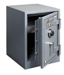

# Attacco ai Dati

## Spionaggio

Anche detto **Data Exfiltration**, è il prelevamento dati da un computer vittima ed il suo invio in rete al computer del criminale.

Informazioni di interesse sono:

* Documenti di qualsiasi livello di sensitività
* Chiavi e password
* Files di configurazione del sistema

Richiede necessariamente:

* Programma **malware** installato sul computer vittima
* Canale di comunicazione, probabilmente _stealth_, tra la vittima e il criminale

L’attività generale di acquisizione informazioni sulla vittima è detta **SigInt** (_Signal Intelligence_).

### Dimensione dello Spionaggio

* **Attacchi in grande stile**
  * La vittima deve avere informazioni di sufficiente interesse nazionale o pubblico
    * Enti militari e di ricerca
    * Istituti finanziari
    * Enti governativi
* **Enti medi e piccoli**
  * La vittima possiede informazioni proprietarie strategiche
    * Industria o business intermedio
    * Catene di distribuzione
    * Enti medici e assicurativi
* **Micro-Intelligence**
  * Informazioni limitate di interesse a certi individui
    * Ruolini paga
    * Documenti di policy

### Piccoli Sistemi

Le informazioni più a rischio di esfiltrazione sono sui mini e micro sistemi:

* personal computers
* smartphones e tablets

L’attività di navigazione web implica, anche involontarie:

* la condivisione della lista contatti
* il tracking di navigazione tramite cookies ed altro
* la rivelazione della locazione geografica
* i patterns d’uso
* le caratteristiche del sistema e dell’hardware

Sono tutti punti d’aggancio per attacchi di _SigInt_.

Considerazioni di base:

* **I piccoli sistemi non devono avere informazioni sensitive**
* **I sistemi con informazioni sensitive non devono navigare in rete**

Al limite impostare delle _whitelist_ dei soli siti consentiti. Questo può diventare tedioso, ma aumenta fortemente la sicurezza, e impedisce che il personale navighi a caso nell'orario di lavoro.

### Esfiltrazione Fisica

Dati sensibili possono essere sottratti da parte di personale interno su:

* chiavi USB e dischi fissi
* smartphones
* PC portatili
* altri dispositivi rimuovibili di registrazione dati

Un ente con dati sensitivi e in regime di alta sicurezza deve proibire la presenza di tutti questi dispositivi

* Segmentare i locali acceduti in classi di sicurezza
* Monitorare anche il personale di pulizie e servizi

Attenzione alla corretta distruzione di dati

* Cartaceo in uno _shredder_
* Limitare al minimo i documenti provvisori in cartaceo
* Supporti dati in collezione separata poi inceneriti
* Conservare tutto il materiale sensitivo in cassaforte.

Le chiavette USB sono un grosso disatro di sicurezza e andrebbero proibite: ci si mette su il lavoro aziendale insieme alle foto dei figli e a filmini porno. Le foto contengono coordinate GPS e i filmini dei virus di vario tipo.

Poi vengono usate per passare dei file veloci ai colleghi, che si copiano anche il resto.

Molte ditte forniscono un PC portatile che ci si porta anche a casa e si usa per altri scopi, con pericoli a non finire di introduzione di malware in ditta.

I documenti temporanei stampati sono email, documenti word, fogli excel. Poi vengono buttati nel cestino di riciclo carta e messi fuori dalla porta. Io ne ho trovati a iosa negli enti pubblici in Toscana, dove sono ecologici. Si imparano cose imbarazzanti.

I PC vecchi vengono anch’essi o buttati o portati a stazioni di riciclo e abbandonati, con tutti i dati ancora dentro!

### PC Roaming

PC degli executives, che viaggiano e che devono comunque contenere dati sensibili.

La quotazione di ricettazione di un PC di un executive di una ditta Fortune 500 è in America circa $10000.

I furti avvengono soprattutto negli aeroporti.

Contromisure:

* Crittografazione del disco fisso
* Backup su supporti crittografati che non viaggiano col PC
* Whitelist di navigazione web
* Comunicazione con **Virtual Private Network**  e solo con la casa madre
* Schermo con campo visuale ristretto
* Togliere tutte le icone dallo schermo
* Eliminazione di logo e distintivi aziendali

In un qualsiasi aeroporto o treno Italo si vedono persone che lavorano al loro notebook in maniera forsennata. Quando il treno va a Roma il gergo lo chiama “portare il lavoro a Termini”.

Con una telecamerina è molto discreta di 70 ingrandimenti si vede benissimo quello che fanno.

All’aeroporto si mette il PC sul carrello poi si aspetta il proprio turno per i raggi X. C’è un intoppo e ci si mette tempo. Poi quando si arriva di la il PC non c’è più.

Davanti all’hotel vicino a Termini mentre si telefona alla moglie un cinesino scippa la borsa col PC e fugge verso il quartiere Esquilino. Impossibile ribeccalo.

Alla stazione a Torino un albanese ti urta maldestramente e cadete tutti e due. Poi quando ti aiuta a rialzarti il tuo trolley non c’è più. E mentre ti guardi disperato in giro è sparito anche l’albanese.
Consigli: i dati sono crittografati, mantenere un backup su One Drive e usare un PC che non costa più di €400 (si chiama un “Computer Bic”).

### Contromisure per i Server

Dipendono dalla sensitività dei dati

* Storaggio sicuro dei dati
  * Sicurezza fisica di accesso
  * Cura della sicurezza dei backup e delle repliche
* Autenticazione d’accesso forte
  * Autenticazioni multi-fattore
  * Certificati anche per i client
  * Logging degli accessi e auditing periodico
* Crittografazione delle comunicazioni
  * Crittografare anche le comunicazioni interne
  * Reti Virtuali Private (_VPN_ - _Virtual Private Networks_)
* Firewalls intelligenti
  * _Proxy_ - niente accesso diretto interno-esterno
  * _Intrusion Detection Systems_ (IDS) anche per i dati in uscita

## Data Tampering

E’ la modifica ai dati storati nel sistema vittima, a vantaggio del criminale remoto:

* dati sensibili o non riproducibili
* dati di Personal Identification Information (PII)
* tokens di autenticazione
* attributi collegati all’identità
* profili di autorizzazione

Si possono distinguere due casi:

* **Modifiche non scoperte**
  * Possono causare danni o perdite anche gravi
* **Modifiche scoperte**
  * Anche solo poche modifiche possono causare una mancanza di fiducia in tutti i dati

Occorre un’assoluta fiducia nell’integrità dei dati.

Questo implica anche test continuativi di efficacia.

### Indizi di Tampering

Occorrono strumenti di monitoraggio continuo e detezione anomalie: Host-based Intrusion Detection System (H-IDS).

Indizi comuni possono essere:

* Picchi anomali di accessi falliti
* Picchi di accesso ai dati
* Attività inconsuete di accesso ai dati
* Accessi fuori da orario consueto
* Accesso a dati archiviati

Uno **IDS Net-based** è un intero computer che monitorizza la rete alla ricerca di pacchetti dati anomali.

Uno **IDS Host-based** è un programma su un computer che lo monitorizza in continuazione alla ricerca di programmi o comportamenti anomali.

### Difese dal Tampering

Esistono più linee di difesa, da progettare:

* **Checksum dei dati**
  * Calcolo di un checksum a intervalli regolari
  * Mantenere i checksum crittografati o offline
  * Verifica regolare dei checksum
  * Allerta immediata in caso di cambiamento imprevisto
  * Vi sono strumenti automatici appositi
* **Versionamento dei dati**
  * Le procedure ufficiali che modificano i dati ne compiono un commit al termine
  * Il versionamento automaticamente fornisce un timestamp e compie un checksum
  * E’ sempre possibile un checkout ad una previa versione
* **Blockchain**
  * Per sua natura è immutabile
  * Mantenere nel blockchain i dati o i puntatori ai dati

Un **Checksum** è un numero Hash calcolato da un file; se cambia il file cambia anche il checksum.

Programmi che forniscono e mantengono checksums sono economici ma richiedono disciplina d’uso.

Per lo sviluppo programmi e documenti a più riprese, un **Controllo Versione** non solo fornisce un checksum, ma permette anche di tornare a versioni precedenti.

Le tecnologie **Blockchain** sono il futuro prossimo della sicurezza dei dati. Un Blockchain è un archivio immutabile e storico di tutte le versioni compiute. Al momento lo si usa per Bitcoin, ecc. ma presto esploderà in tutti i campi applicativi.

### Osservazioni

Più probabilmente l’attacco di Data Tampering proviene dall’interno:

* Computer zombie o con volontà della persona

Occorre identificare al più presto:

* L’**agente** colpevole
* Quali siano i **dati corrotti**
* Quali siano i **dati non coinvolti** e di cui ci si fida

Devono essere configurate procedure automatiche di backup dei dati, e devono essere compiuti test continui e veritieri di restore parziale.

Un restore può non ripristinare l’ultima versione corrente dei dati:

* I dati devono essere suddivisi in classi con indice di tempo di perdita accettabile.

**Zombie** è un computer controllato da remoto da uno hacker.

Occorre per primo determinare quale sia il programma che corrompe i dati e fermarlo.

Se non siamo subito in grado di determinare il programma malefico occorre spegnere il computer di brutto - non shutdown - e sottoporlo ad Analisi Forense, che può essere operazione lunga e penosa.

Un computer che corrompe i dati non deve rimanere acceso!!

Poi bisogna essere in grado di determinare quali sono i dati corrotti e quali ancora no. Se non siamo in grado tutti i dati devono considerarsi potenzialmente corrotti.

In tal caso occorre un restore da una copia garantita non corrotta.

## Ripudio

Vista la pervasività di dati illegali o programmi malefici su ogni tipo di computer, impiantati a insaputa del possessore, si può verificare la seguente situazione:

Il possessore è veramente responsabile dei dati o programmi, ma lo nega: ripudia la responsabilità.

Gli elementi software illegali sono spesso dissimulati da software e dati legali o borderline con metodi di steganografia (dati nascosti). I livelli di dissimulazione possono essere molteplici.

Situazione esempio di diniego plausibile:

* Un file PDF quando esaminato con metodi anti-steganografici rivela contenere un’immagine porno.
* Le autorità concludono che tale è il materiale nascosto (non completamente illegale) e sono soddisfatte.
* L’immagine porno a sua volta però contiene un archivio di password o altri dati veramente sensibili.

La steganografia è diversa dalla crittografia e viene approfondisce nel seguito. E’ una serie di metodi per nascondere i dati in modo che nessuno nemmeno ne sospetti l’esistenza.

Naturalmente gli analisti bravi cercano e trovano i dati nascosti. A questo punto la difesa è di dissimularli facendoli appartenere a categorie diverse dalla loro natura: questo è detto **Diniego Plausibile**.

E’ una operazione di _Ingegneria Sociale_ (vedi oltre): immediata categorizzazione del colpevole e della colpa, errata ma plausibile. La furbizia stà nel fingere i dati nascosti come materiale immorale.

I veri dati nascosti, pericolosi e non immorali, sono ad un livello di occultamento ulteriore. Ma l’analista crede di aver trovato tutto il trovabile e non cerca oltre.

### Contrastare il Ripudio

L’unico metodo efficace è un auditing estremo di tutte le operazioni compiute da tutti, molto poliziesco, molto pesante di amministrazione.

In assenza di auditing non si possono avere prove certe, e l’amministratore che ripudi la volontà propria nel Data Tampering non può che essere assolto per assenza di prove.

Se il sistema ha un livello di sicurezza elevato, per esempio **Security Enhanced Linux** (_SELinux_) (pronuncia: “esse e linux”), tutti i dati e programmi hanno un possessore ben identificato ed il ripudio è impossibile.

SELinux è un sistema sofware imposto dall’agenzia NSA americana per i computer degli enti pubblici.
E’ mito metropolitano che SELinux inoltre compia spionaggio automatico per la NSA.

Ma è richiesto _Linux Enterprise_ e l’amministrazione di SELinux è complessa.

Con sistemi personali o mobili il ripudio deve essere accettato, con beneficio del dubbio per il possessore.

Quello che è veramente importante è **impedire che i dati sospetti escano e transitino in rete**, quindi la scoperta di tutti i possibili canali di comunicazione nascosta tra un computer e l’hacker remoto, e la loro eliminazione.

In alcune nazioni la crittografazione di file systems è illegale, o la polizia deve essere fornita di _passphrase_ d’accesso a richiesta.

Possono essere impiegati “metodi convincenti”.
