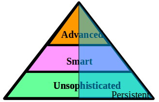
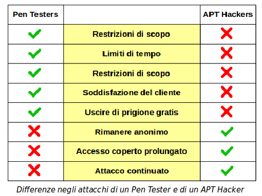

# Attacchi Avanzati

## Threat

Un **threat** è una minaccia potenziale ad un sistema informativo con più o meno difese.

Quando le difese sono superate si ha un **breach** (ingresso).

Conseguentemente al breach si possono avere danni.

Sono visti tre livelli di threat:

* **Unsophisticated**
  * Di bassa intelligenza
  * Le normali difese bastano
* **Smart**
  * Con strumenti intelligenti
  * Più difficile contrasto
* **Advanced**
  * Con molti strumenti d’attacco
  * Molto ardui da contrastare

Se l’attacco è pesante e continuato vi si dà l’attributo **Persistent**.

Una minaccia ha un target definito e non è traffico casuale.

Una minaccia non sofisticata è un esecizio hacker da principiante.

Una minaccia smart è più complessa, contiene dissimulazione, ha un inventore più capace, e richiede una difesa più pianificata. Si tratta comunque sempre di una tipologia singola di attacco.

Uno Advanced Threat è superintelligente, usa molte tipologie di attacco simultanee, è costato svilupparlo e costa mantenerlo.

Persistent denota solo che l’attacco dura nel tempo. In realtà solo le minacce Advanced sono anche Persistent, le altre due sono di bassa lega e non ne vale la pena.

### Advanced Persistent Threat

I target di Advanced Persistent Threats (**APT**) sono sistemi di alto valore, non PC.

Gli APT Hackers sono gruppi organizzati o enti statali:
La conduzione di attacchi APT richiede molte risorse

Gli APT Hackers devono essere molto competenti

I sistemi target hanno elevate difese passive e sistemi di detezione e prevenzione intrusioni, ma:

Possono venire infettati internamente da malware apposito

Vengono usate spesso vulnerabilità non ancora scoperte, per cui non esistono divese (Zero Day Vulnerabilities)

Le operazioni sono stealth e ben dissimulate

Lo APT viene a volte scoperto molto dopo (mesi) il suo impianto, quando ha causato danni considerevoli

C’è spesso l’elemento sorpresa: tipi di attacchi innovativi e non previsti.

Uno 0day - Zero Day Vulnerability o Virus o Attack - è qualcosa che non si era visto prima, e come con un nuovo virus biologico non vi è immunità nè vaccini. Ci vuole tempo a svilupparli e intanto i sistemi sono vulnerabili.

Uno APT è una vergogna per le grosse ditte o enti statali che lo subiscono, e a volte quando è scoperto non viene ammesso.

Questo è vero soprattutto per gli Enti Finanziari, che perderebbero reputazione e clienti.

A volte la denuncia che un ente ha subito un APT può essere fake, allo scopo di danneggiarli. Purtroppo se si può dimostrare di aver subito un APT, non si pò facilmente dimostrare di non averlo subito.

I fake news sono comunque sempre un grosso problema di reputazione.

### PenTesting e APT

Le attività di un Penetration Tester e di un APT Hacker sono simili, ma hanno anche differenze notevoli.

Un PenTester compie attività legali, evidentemente un APT Hacker no.

