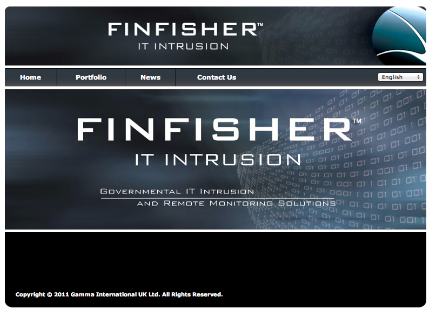
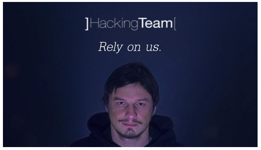
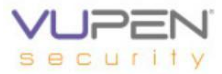

# Servizi di Hacking

## Hacking-as-a-Service

Sia ditte che gruppi che privati offrono servizi di hacking a pagamento. La situazione legale può essere incerta, come per il commercio di armi.

Gli individui e i gruppi di hacker sono tipicamente reperibili sul **Dark Web**. In queste categorie le attività sono sempre coperte e formalmente illegali.

Le ditte ufficialmente offrono servizi di Sicurezza Informatica, Sorveglianza o Recupero Password - a volte è una facciata per veri servizi criminali. Se il cliente è un ente delle forze deell’ordine o le operazioni sono al di fuori dello stato, esistono scappatoie legali per il commercio.

Ditte che forniscono strumenti e servizi di sorveglianza, spionaggio e attacco hacker sono, per esempio:

* BlueCoat
  * Routers con sniffers e taps
* Gamma
  * FinSpy e **FinFisher**
    * Licenza, installazione e training per la polizia segreta dell'Egitto: €300.000

Clienti tipici:

* Non hanno la tecnologia per sviluppare strumenti simili in proprio
* Governi autoritari arabi o del terzo mondo
  * Prove per Malesia, Etiopia, Egitto

Target tipici:

* Dissidenti politici che vivono in aree non direttamente controllate dalle forze nazionali

### Gamma FinFisher

Ha svariate _features_:

* Bypass di 40 antivirus comuni tramite mutazione del codice
* Canale covert di comunicazione con HQ
* Pieno monitoraggio di Skype
* Sorveglianza covert con webcam e microfono del PC
* Key-logger
* Tracciamento di locazione con vari metodi
* Upload covert di files da HD
* Analisi forense remota
* Filtri di rilevanza configurabili
* Agente disponibile per Windows, Linux, Mac
* Infezione tramite tecnologie Metasploit o Ingegneria Sociale
* Fatturato stimato €98M (2006-2013)
  * Di cui €2M dall'Italia

Gli “impiegati” delle ditte menzionate sopra, che sono anglosassoni, devono essere inglesi, di buona famiglia e di buona educazione. Devono avere visione politica ultraconservativa e preferibilmente aver lavorato per i “servizi”.

C’è un forte sospetto che tali ditte siano molto coinvolte col governo di Sua Maestà.

### Hacking Team

Hacking Team (Via della Moscova13, Milano, Italia)

* Da luglio 2012
* Attacchi documentati in Marocco, Repubbliche Arabe Unite, Colombia, Kazakistan, Oman, ... (fonte WikiLeaks)
* Committenti: governi ufficiali (ma non ufficialmente)
  * Anche fornitore della polizia italiana
* Targets: gruppi di dissidenti
* Sito web pubblico: `www.hackingteam.it`
  * Offrono lavoro (tel. 02 29060603)
* Hackerati di recente: 1 milione di messaggi email

La Hacking Team e altri sono sempre alla ricerca di personale di due tipologie.

La prima è di **programmatori** e hacker super esperti - quelli che “sognano in esadecimale”. Del resto i bravi programmatori non hanno particolari problemi a trovare lavoro.

La seconda fisura professionale sono **executive**, per la vendita e il Business Relationship Management. Sono persone dall’aspetto autorevole, dall’esperienza provata nel mondo cybersecurity, che sanno l’inglese alla perfezione e viaggiare senza farsi notare. E devono essere maschi perchè gli arabi sono il mercato migliore.

### Vupen Security

VUPEN Security (Francia)

Dal 2012 in ex colonie francesi.

* Attacchi basati su 0day Exploits
* Collaborazione probabile con Hacking Team ed altri
* Spudorate asserzioni di solo comportamento etico nel Customer Policy

La deontologia professionale del programmatore richiederebbe che chi scopre uno Zero Day Vulnerability lo comunichi alla ditta che ha scritto il programma.

Purtroppo non tutte le ditte software hanno l’umiltà di ammetterlo o la dovuta riconoscenza verso lo scopritore.

Il vantaggio di Vupen e altre ditte simili è che pagano per gli 0day, fino a €50000 per quelli più appetibili.

