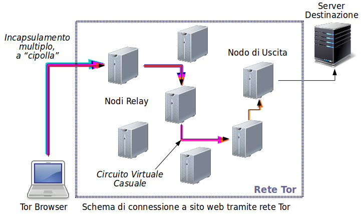
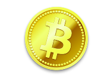

# Dark Net

Non tutti i computer esistenti al mondo sono visibili in Internet o reperibili con i normali motori di ricerca.

Si distinguono tre livelli di rete:

* **Clear Net** (_Surface Net_ - _World Wide Web_)
  * Sono i computer registrati nei domini e reperibili tramite normale ricerche DNS (_Domain Name System_)
* **Deep Net** (_Deep Web_)
  * Sono computer non registrati a dominio, o registrati in domini alternativi a quelli ufficiali. Spesso sono computer di reti locali o i client e i personal computer.
* **Dark Net** (_Dark Web_)
  * Sono computer volutamente nascosti alle normali ricerche e per accedere ai quali occorre software particolare.

_Dark Net_ e _Dark Web_ sono praticamente sinonimi.

Nella sua accezione, la Dark Net è una **overlay network**, ovvero usa il trasporto di base della normale Internet.

Vi sono ancora (poche) reti che usano trasporti completamente alternativi, spesso storici, come _UUCP_ o _FidoNet_ un tempo basati sui modem. Sono quasi introvabili dalle polizie, ma molto inefficienti.

I protocolli usati dalla Dark Net sono volutamente diversi da quelli della Clear Net. Lo scopo è di sfuggire al controllo delle autorità nazionali di vigilanza.

Alcuni stati perseguono ideologie, religioni, politiche ed orientamenti specifici. In tali stati l’uso del Dark Net è un vantaggio libertario.

L’uso etico o meno della Dark Net è indipendente dalle tecnologie.

Vi sono vari ambienti Dark Net, tra cui _GUnet_, _Freenet_, _I2P_ e soprattutto **Tor**.

## Tor

Progetto libertario per la privacy online consistente in un browser Firefox modificato.

* Usa la rete con **Onion Routing**
* Permette la navigazione anonima
* Disponibile per Windows, Mac, Linux e Android

E’ basato sul contributo volontario di macchine che fungono da relay per l’implementazione della rete anonima - al momento sono circa 6000.

E' odiato e combattuto da polizie ed enti statali.

Il fatto che parecchi nodi dello _Onion Routing_ ormai appartengano a polizie o enti di spionaggio non ne inficia il comportamento anonimo.
Solo se un ente controlla tutti i relay d’uscita è in grado di impedire il traffico.

Comunque è praticamente impossibile determinare il mittente.

In alcuni stati il possesso di Tor è illegale.

Tor è Open Source e quindi dimostrabilmente libero da trucchi o malware.

Chi lo usa si assume la responsabilità se sta violando la legge locale per l’uso che ne fa.

Non serve solo a navigare nel Dark Web ma anche ai giornalisti o ai dissidenti politici.

I relay sono gestiti da volontari entusiasti e sono in paesi dove la libertà di comunicazione è sanzionata dalla legge. Questi sono tendenzialmente nel modo occidentale.

In paesi ove Tor è proibito è possibile impostare dei “bridge” non listati alla rete Tor che semplicemente confondono ulteriormente il traffico senza crittografarlo.

In pratica la rete Tor è una grossa collezione di _stepping stones_.

L’uso appropriato e flessibile, per aumentare ancora la sicurezza, prevede tutta una serie di configurazioni. Leggere il manuale.

Alcuni formati come Flash (_FLV_) sono considerati troppo pericolosi e non portati da Tor. Questo esclude gran parte dei siti porno tradizionali - molti si sono adattati a MP4 o formati streaming.

### Onion Routing

Lo “Onion Routing” - a cipolla - si chiama così perchè ogni singolo pacchetto è composto da più strati.

Una prima fase iniziale scopre tra tutti i nodi della rete quali sono attivi e disponibili e decide casualmente un certo numero di essi da cui tansitare, ovvero stabilisce un “circuito virtuale”. Questo viene cambiato ad intervalli regolari scegliendo un altro insieme di nodi intermedi.

Viene generato il pacchetto finale in chiaro tra il nodo di uscita dalla rete Tor e il server web di destinazione. Questo pacchetto viene “incapsulato” in un pacchetto più grande per il traffico tra il penultimo nodo e il nodo di uscita, e crittografato con la chiave pubblica del nodo finale.

A sua volta tale pacchetto è incapsulato in un altro per il traffico tra il terzultimo e penultimo nodo, e crittografato con la chiave pubblica del penultimo.

Così via a ritroso fino alnostro computer, il mittente iniziale.

Nessun intercettatore di traffico sa mai più che il mittente del tratto locale. I mittenti dei tratti precedenti sono crittografati. E’ impossibile conoscere il mittente originale.

Il nodo di uscita è il più delicato perchè vede il traffico in chiaro. Può dedurre il sistema operativo del mittente, il nome del browser e la dimensione dello schermo. Ma anche queste informazioni possono essere dissimulate con un po’ di avvedutezza.

## Dark Web in Pratica

Più del 90% del Dark Web ospita contenuti di commercio Business to Consumer, illegali secondo i canoni occidentali.

* **Materiale fisico**
  * Armi
  * Droghe
  * Documenti falsi
  * Ricettazione
* **Servizi**
  * Furti
  * Omicidi
  * Spionaggio ed attacchi a computer
  * Riciclaggio di denaro sporco
* **Materiale informatico**
  * Pedopornografia
  * Violazione di copyright

La valuta di pagamento usuale è **Bitcoin**.

Se si comportano con alcune cautele, gli amministratori ed utenti del Dark Web sono in pratica non identificabili.

Purtroppo in pratica si usa Tor per accedere al Dark Web e sfuggire al controllo della polizia per compiere attività illegali.

Paesi diversi hanno evidentemente insiemi diversi di attività illegali.

Il pagamento avviene in valuta difficilmente rintracciabile, quindi prevalentemente Bitcoin. Nessuno ha veramente modo di lamentarsi se viene imbrogliato.

La difficoltà è il recapito di oggetti fisici. La malavita si è ormai organizzata anche come corrieri di materiale acquistato nel Dark Web.

Non è evidentemente necessaria alcuna registrazione o prova di identità per comprare sul Dark Web, basta pagare. Se viene presentato un form di registrazione, è inteso che venga fornito uno pseudonimo inventato e non il nome vero: questo serve solo al riconoscimento di sessione.

Le aziende sul Dark Web vanno e vengono in continuazione perchè spesso scoperte dalle polizie nazionali. P.es. il sito “Silk Road”, che vende droghe, è già nella sua terza incarnazione.

Qualora servisse nel Clear Web, vi sono anche siti che offrono un indirizzo di posta elettronica temporaneo o altri token di identità finti.
