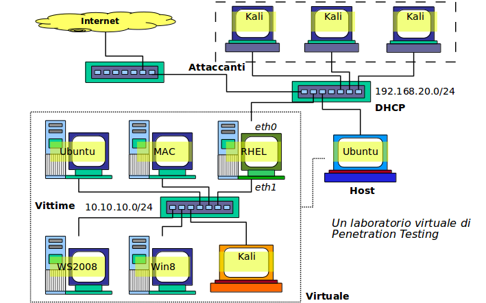

# Strumenti e Tecniche Hacker

Per contrastare efficacemente gli hacker occorre conoscere i loro strumenti ed il loro modo operativo. Chiunque può studiare i metodi hacker, ma la comprensione e maestria richiede molto tempo.

E’ opportuno che una qualunque ditta di medie o grandi dimensioni abbia personale di sicurezza che compie training specifico nelle tecniche hacker.

Gli utenti finali possono solo comprendere i pericoli ed applicare regolarmente le pratiche che li minimizzano.

## Kali Linux

> The quieter you become, the more you are able to hear.

La collezione più completa di tools è nella distribuzione **Kali Linux**.

Immagine ISO a https://www.kali.org/.

Installare su chiave USB oppure come Macchina Virtuale.

E' un sistema operativo completo con 250+ strumenti hacker.

Serve per esercitazioni di PenTesting ed acquisizione di esperienza.

E' prodotta da _Offensive Security_:

* Comunità Open Source
* Molto attiva in vari aspetti della cybersecurity
* Catalogazione strumenti e vulnerabilità

## Laboratorio di Pentesting

## Vittime

Occorrono macchine vittima così come in poligono occorrono dei bersagli a cui sparare. Queste sono tipicamente immagini ISO (o containers).

La più famosa vittima è Metasploitable (https://information.rapid7.com/download-metasploitable-2017.html).
Altre vittime vulnerabili si trovano su https://www.vulnhub.com/:

* Collezione di 100+ sistemi vulnerabili
* Vari livelli di difficoltà
