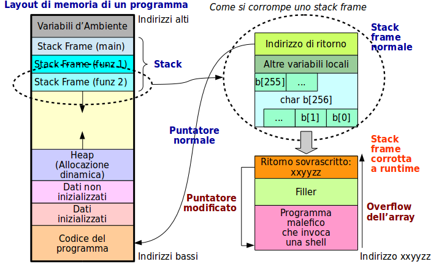

# Buffer Overflow

E’ una vulnerabilità presente in un numero elevato di programmi scritti male.

Lo sfruttamento consiste nell’input al programma di una stringa molto lunga e complicata (questa è una operazione compiuta in automatico da un programma specifico di Exploit, non manualmente).

Il risultato è spesso il lancio di una shell con i privilegi del programma in esecuzione - anche amministrativi.

Vi sono molte varianti di Buffer Overflow, la più nota da tempo è l’overflow di uno Stack Frame.

Per approfondire: “Smashing The Stack For Fun And Profit”, Phrack Magazine, n. 49, file 14 (http://insecure.org/stf/smashstack.html) - articolo molto tecnico.

## Vulnerabilità a Buffer Overflow

La maggior parte dei programmi sono scritti in Linguaggio C o linguaggi derivati, e hanno le seguenti vulnerabilità:

* Vulnerabilità di **struttura in memoria** di un programma
  * Ogni funzione ha il suo **stack frame** con variabili locali
  * Gli stack frames sono allocati a memoria _decrescente_
  * Le variabili sono allocate a memoria _crescente_
  * All’inizio dello stack frame (_memoria alta_) c’è l’**indirizzo di ritorno** della funzione
* Vulnerabilità **introdotte dal compilatore**
  * Il linguaggio C non controlla il superamento delle dimensioni dell’array dichiarato (overflow)
  * Viene semplicemente sovrascritto quello che vi si trova
* Vulnerabilità **di base dei computer**
  * L’architettura di _Von Neumann_ di tutti i computer moderni non vede alcuna differenza tra un byte di dati e uno di istruzioni.

Il tutto è una ricetta per un disastro.

## Conduzione di un Buffer Overflow

Occorre che la funzione 

* allochi un buffer (array) di caratteri
* contenga una o più funzioni che non controllano l’overflow
  * Sono tante: `strcpy()`, `strcat()`, `sprintf()`, `scanf()`, …

Il programma che invoca la funzione
* fornisce una stringa più grande del buffer della funzione (causa un overflow)
  * di solito letta da input di terminale o di rete
  * l’input contiene caratteri che in realtà sono codice malefico
    * spesso l’invocazione di una shell, da qui il nome **ShellCode**
  * fa in modo di sovrascrivere l’indirizzo di ritorno della funzione con l’idirizzo del programma malefico

Molti programmi presentano queste vulnerabilità.

Non è facilissimo scrivere ShellCode (in assembler), ma è un’arte nota e sperimentata.

## Contromisure al Buffer Overflow

* Scrivere bene i programmi
  * Solo i programmi **Open Source**, con codice visibile, sono garanzia di qualità e di assenza di altro malware
* Non eseguire i programmi con privilegi amministrativi
  * Se i programmi ne hanno bisogno in alcune parti: impostarli quando servono poi subito toglierli
* Eseguire i programmi in qualche tipo di contenitore
  * Chroot, Jail, Docker, Macchine virtuali
* Per il **Brownfield** (codice legacy non modificabile - opposto di **Greenfield** - codice modificabile):
  * Eseguirli entro del codice involucro (wrapper) che impedisca gli overflow - esempio: Valgrind
* Adottare tecniche di randomizzazione della posizione dei dati negli stack frames (Linux Moderno)
  * Non protegge da tutti i tipi di overflow

