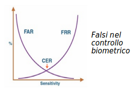

# Identità Informatica

## Concetto di Identità

Per un essere umano fisico l’identità è costituita da:

* **Corpo**
  * Caratteristiche fisiche, stato di salute, ...
* **Mente**
  * Memorie, opinioni, idee, comportamenti, …

In applicazioni informatiche questo concetto materiale non esiste. Si parla di **pseudoidentità**, composta di:

* **Identificativo sintetico univoco**
  * Chiave primaria naturale o generata in un database
* **Attributi primari**
  * Determinano l’Identificazione
* **Attributi secondari**
  * A seconda del dominio dell’applicativo

## Identità Digitale Umana

In Italia vi sono due tipi principali di documenti d'identità informatici:

* **CIE**: _Carta d’Identità Elettronica_
* **SPID**: _Sistema Pubblico di Identità Digitale_

Il documento ha supporto fisico (_CIE_) o elettronico (_SPID_) con gli attributi primari seguenti:

* nome e cognome (enti fisici)
* ragione sociale esede legale (enti giuridici)
* luogo e data di nascita
* sesso
* codice fiscale
* partita IVA (per gli enti giuridici)
* estremi del documento usato per l'identificazione

ed almeno uno dei seguenti attributi secondari:

* numero di telefono fisso o mobile
* indirizzo di posta elettronica
* indirizzo di residenza fisico e/o elettronico

## Identità di un Sistema Informatico

Un sistema informatico (dai PC ai grossi sistemi) offre uno o più **servizi** (dal gioco a Facebook al Servizio Sanitario).

Termini:

* **Identità Informatica** (_Pseudoidentità_)
  * Chiave univoca
  * Lista di attributi primari e secondari
* **Autenticazione**
  * Persona che ottiene un’identità informatica
* **Identificazione**
  * Da un’identità informatica risalire ad una persona (non è sempre necessaria)
* **Profilo**
  * Una lista di attività che si possono compiere e su quali componenti di un servizio
  * (Lettura, inserimento, update, cancellazione, query, … )
* **Autorizzazione**
  * Associazione di un’identità informatica ad un profilo
* **Auditing** (_Accountability_)
  * Risalire da azioni su un servizio alla persona che le ha compiute

### Fattori di Autenticazione

Servono nella fase di Autenticazione per comprovare l’identità dichiarata. Sono parte degli attributi primari.

Tre principali fattori:

* **Conoscenza** (_what you know_)
  * Passphrase, PIN, domanda privata, ...
* **Possesso** (_what you own_)
  * Smartcard, chiavi, OTP, ...
* **Caratteristiche** (_what you are_)
  * Controlli Biometrici
    * Fisiologici: impronte digitali, retina, …
    * Comportamentali: digitazione tastiera, tempi reazione, …

Usare un singolo fattore è autenticazione debole.
L'**Autenticazione Forte** o _Multifattore_ usa almeno due fattori.

### Livelli di Autenticazione

**LoA**: _Level of Authentication_. Standards `ISO/IEC DIS 29115` e `NIST-SP-800-63-2`.

* **LoA0** - fattore singolo con semplice password
* **LoA1** - fattore singolo con password e metodi _challenge-response_
* **LoA2** - fattore multiplo con autenticazione tramite _schemi OTP_
* **LoA3** - fattore multiplo con _token crittografici_
* **LoA4** - fattore multiplo con _crittografia a chiave pubblica_ e uso obbligatorio di _Smartcard_ o Smartkey esterna

### Controlli Biometrici

Misurano le proprietà fisiche esclusive di una persona.

Caratteristiche:

* Possono essere invasivi della privacy fisica della persona
* Devono avere alti standard di pulizia
* Hanno costi elevati
* Il processamento dei dati richiede tempo discreto
* Necessitano di registrazione iniziale della proprietà
* Le proprietà fisiche variano nel tempo o per incidenti

Errori:

* False Acceptance Rate - **FAR**: falso positivo
* False Rejection Rate - **FRR**: falso negativo
* Crossover Error Rate - **CER**: scelta ottimale

Non usare solo i controlli biometrici come fattore.
