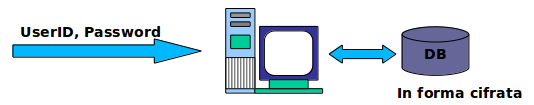
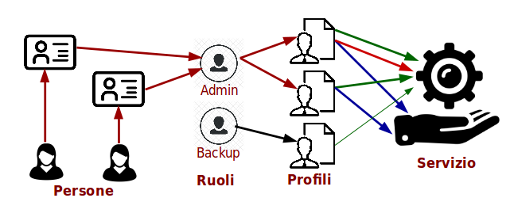

# Schemi di Accesso

## Password

_UserID_ e _Password_ come metodo di autenticazione.

La password è mantenuta sul server acceduto in forma cifrata, tipicamente come hash.

Alcuni algoritmi hash sono insicuri: MD5, SHA1

Altri, più moderni, sono migliori: SHA-256

Non è possibile dallo hash risalire alla password, ma è possibile tentare di indovinarla.

E’ necessario rubare (esfiltrare) il database delle password hash, per poter verificare quando si è indovinato.

Due tipi di attacco:

* **Forza Bruta** (_Brute Force Attack_)
  * Tutte le combinazioni possibili di lunghezza massima
* **Basato su Dizionario** (_Dictionary Attack_)
  * Tutte le stringhe più probabili: date, parenti, attori, giocatori, personaggi, …
  * Con varianti euristiche: maiuscole, numeri apposti, …
  * Aiuta molto conoscere la persona che viene attaccata

Gli algoritmi di hash sono lenti e per un attacco on line si impiega troppo tempo (anni).

Sono però disponibili gigantesche tabelle di hash precalcolati, le Rainbow Tables, con cui si impiega pochissimo tempo (secondi).

## Profili di Privilegi

Insiemi di privilegi d’accesso ad un servizio e alle sue componenti. Detti anche **Grants**.

L’autorizzazione è l’associazione di un’identità digitale ad un profilo di privilegi.

Principi guida nell’assegnazione di privilegi:

* **Minimo Privilegio Necessario** (_Minimum Privilege_)
  * Non assegnare privilegi non necessari al compimento del lavoro stipulato
* **Necessità di Conoscenza** (_Need to Know_)
  * Non permettere la rivelazione di informazioni non necessarie
* **Separazione di Compiti** (_Separation of Concerns_)
  * Compiti di lavoro diversi devono avere profili di privilegi diversi

## Ruoli

**Role Based Access Control** - _RBAC_

Stato intermedio tra un’identità informatica e un profilo.
Un utente può assumere più ruoli. Più identità informatiche, quindi più persone, possono assumere lo stesso ruolo, con ulteriore autenticazione.

Ad ogni ruolo è associato uno o più profili simultaneamente.

La maggiore granularità permette una gestione più fine dell’ambiente di sicurezza.

## Single Sign On

Rimuove la necessità di riautenticarsi su piattaforme diverse dello stesso dominio.

Non richiede di ricordarsi più password diverse.

Fornito da un **Key Distribution Centre** (_KDC_).
L'esempio più tipico è _Kerberos_.

* Utilizza chiavi simmetriche di sessione
* Fornisce timestamp di attività
* Può essere un punto debole (_Single Point Of Failure_)
* Necessita ridondanza e protezione fisica

Gestione del DB di identità centralizzato:

* **Liste di Controllo Accesso** - _Access Control Lists_ (_ACL_)
* **LDAP** - _Lightweight Directory Access Protocol_
  * Associa una Pseudoidentità ad Attributi

La combinazione di _Kerberos_ e _LDAP_ costituisce quello che viene detto **Servizi di Directory**. Per esempio in Windows questo è implementato da **Active Directory**.
