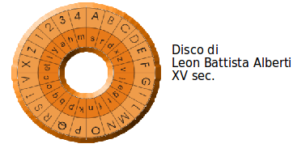
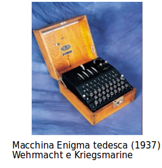
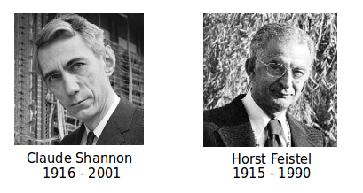
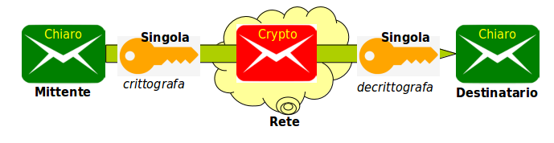
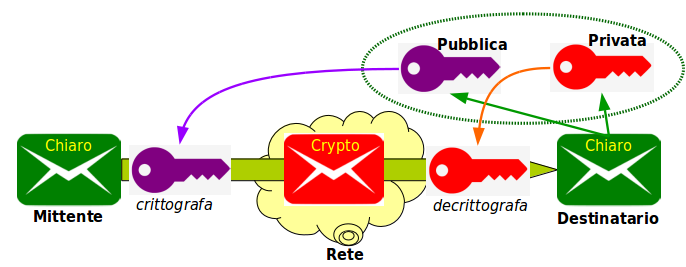
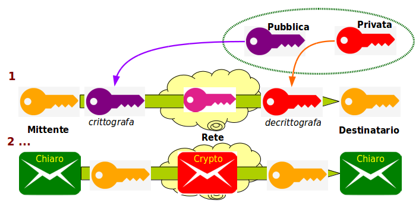

# Crittografia

Il tentativo di offuscare o nascondere il significato di un messaggio, affinchè non venga compreso dal nemico anche se cade nelle sue mani, è un'arte antichissima.

Il termine viene dal greco κρυπτóς, nascosto. Sicuramente i greci e gli antichi ebrei facevano uso di crittografia, ma anche imperi e popolazioni dell'Asia antica.

L'argomento è stato sistematizzato da Leon Battista Alberti, nel suo _De Cifris_, ma è stato soprattutto a partire dal XVIII secolo, con le guerre tra stati sovrani, che ha ricoperto un carattere strategico.

Esempio di cifrario di Leon Battista Alberti.

Prima e durante la seconda guerrs mondiale fu introdotta la crittografia a rotore.

Molte sono state le implementazioni meccaniche di Rotori, a più famosa rimane quello della macchina Enigma, usato sia dall'esercito che dalla marina germaniche.

Ma soprattutto dopo la II Guerra Mondiale, scoperte sulla crittografia asimmetrica (segreti di alcune nazioni fino al loro riconoscimento pubblico), hanno impostato gli strumenti che oggi usiamo in Internet.

Crittografare i dati in transito sulla rete ha i seguenti vantaggi:

* Viene impedita non tanto l’intercettazione, quanto la comprensione dei dati - **Assicurazione di Confidenzialità**
* E’ possibile la modifica, ma il ricevente se ne accorge quando non è più in grado di leggere i dati - **Assicurazione di Provenienza e di Integrità**

La crittografia moderna è digitale ed è basata su:

* **Algoritmi**
  * Le procedure matematiche di codifica e decodifica dei dati
  * Implementati come programmi, procedure, funzioni
* **Chiavi**
  * Sequenze di bit usati nella codifica
  * Note solo ai corrispondenti, configurate manualmente

Tutti i maggiori algoritmi sono ben noti nel mondo.

E' opinione di maggioranza degli studiosi che gli algoritmi più sicuri sono quelli il cui codice è _Free and Libre_, ovvero a disposizione di tutti.

> “Il nemico conosce il metodo usato” - _Shannon_

I migliori algoritmi codificano un blocco di bit per volta (64 o 128 bit) - Famiglia di **Algoritmi di Feistel**.

## Tipi di Chiavi

### Chiavi Singole

Sono anche dette _Chiavi Simmetriche_.

La stessa chiave è usata per crittare e decrittare il messaggio.

* Molto veloce
* Ha il problema della Distribuzione della Chiave, al mittente e al destinatario
  * Spesso c’è un Key Distribution Center (KDC) - Kerberos
  * Fattibile in ambiente **Business-to-Business** (_B2B_) ma non **Business-to-Consumer** (_B2C_)

In altre parole questo metodo non è applicabile alla crittografazione di pagine web.

Il problema è quello della **Distribuzione Chiavi**, che deve avvenire prima della comunicazione normale e su un canale o con un metodo molto più sicuro, per esempio con interscambio umano.

### Chiavi Doppie

Anche dette _Chiavi Asimmetriche_ o _Chiavi Pubbliche_.

Un algoritmo particolare, e non ve ne sono molti, genera una coppia di chiavi, dette **Pubblica** e **Privata**, e queste sono in relazione tra loro. 

Il messaggio crittato con una delle chiavi può essere decrittato solo con l’altra chiave.

Il destinatario fornisce in chiaro al mittente la propria chiave pubblica, che viene usata per crittare il messaggio.
Tutti i potenziali mittenti devono essere in grado di conoscere la _chiave pubblica del destinatario_, non è un segreto e da sola non basta a decrittare il messaggio.

Il destinatario decritta il messaggio con la propria chiave privata, sicuro di essere il solo a possederla.

Questo metodo può essere direttamente applicato per crittografare pagine web, purtroppo è moolto più lento che non l'uso di chiavi singole.

La soluzione è di utilizzare una **Chiave di Sessione**.

Il mittente all’inizio critta non il messaggio, ma una chiave singola (chiave di sessione) e la invia al destinatario - avviene l'_interscambio di chiavi_.

Viene quindi usata tale chiave singola per il resto della sessione di comunicazione.

Questo metodo fornisce la **Assicurazione di Confidenzialità** del messaggio.

## Algoritmi di Hash

Vi sono algoritmi di trasformazione di blocchi di bit deterministici e monodirezionali, che non usano chiavi.

Uno di tali algoritmi, applicato ad uno stream di input di lunghezza qualsiasi, ricava un numero fisso di bit di output: lo **hash**, o _segnatura_ o _digest_.

Con precisione computazionale (elevatissima probabilità ma non certezza):

* Due input uguali producono lo stesso hash.
* Due input diversi producono hash diversi.

Se ciò non avvenisse si chiamerebbe una **collisione**.

Non è possibile dallo hash risalire all’input originale.

Vista la corrispondenza uno-a-uno tra un messaggio e il suo hash, quest’ultimo ne è un rappresentativo, un **Message Digest**.

Uno dei più usati è **SHA-256** - _Secure Hash Algorithm_ con digest a 256 bit di lunghezza.

Gli hash vengono usati nella firma elettronica per avere la **Assicurazione di Provenienza**, cioè che il messaggio proviene veramente dal mittente dichiarato.

### Firma Elettronica

![FirmEl][../gitbook/images/firmel.md]

Il mittente:

* Calcola lo hash del messaggio in partenza
* Lo hash viene crittografato con la _chiave privata del mittente_ e il risultato allegato al messaggio - il messaggio è **firmato elettronicamente**.

Il destinatario:

* Calcola lo hash del messaggio ricevuto
* Decrittografa lo hash allegato con la _chiave pubblica del mittente_.
* Se sono uguali, la firma è verificata.

