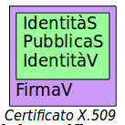
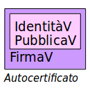
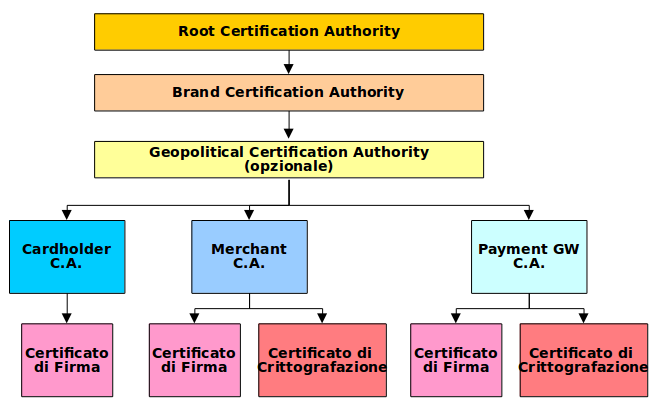

# Certificati

## Il Problema della Fiducia

Il destinatario di un messaggio da crittografarsi invia al mittente la propria chiave pubblica, _in chiaro_, con qualche protocollo di rete.

Il destinatario si vede arrivare dalla rete una chiave pubblica dichiarata appartenere ad un certo destinatario.

La chiave pubblica rappresenta l’dentità del destinatario di un messaggio, Ma come può il mittente essere sicuro che la chiave pubblica appartenga a quel destinatario?

Se non fosse così potrebbe inviare il messaggio segreto al destinatario sbagliato - un impersonatore.

Occorre fidarsi di qualcuno. Ma in ambiente B2C i soggetti destinatari possibili sono milioni.

La soluzione è di concordare su  un numero molto ristretto (max. qualche decina, o diventa ingestibile per il software) di **Enti Fidati** a priori, e far sì che questi enti forniscano una _firma elettronica_ (come notarile) della chiave pubblica di ogni soggetto che lo richieda.

Tale documento di firma notarile si chiama **certificato**.

Un soggetto per provare la propria identità si procura un certificato emesso da uno degli Enti Fidati.

Un certificato è un documento elettronico conforme allo Standard **ITU-T X.509**.

Descrive due attori: il **soggetto certificato** (_S_) e l’**ente certificante** (_V_).

Contiene alcuni campi notevoli:

* Identità del soggetto
* Chiave pubblica del soggetto
* Identità del certificante
* Stringa di firma del documento con la chiave privata del certificante

### Autocertificato

Per poterne verificare la validità il software di gestione 
deve avere precaricato un autocertificato dell’ente certificante:

* Identità del certificanre
* Chiave pubblica del certificante
* Firma con la chiave privata del certificante

Un autocertificato è il formato standard X.509 per la descrizione delle chiavi pubbliche degli Enti Fidati _a priori_.

Non può essere accettato dalla rete. Deve essere configurato manualmente nel software di gestione, oppure compilato nel codice del software.

#### Attenzione

L'installazione di certificati surrettizia, inavvertita o causata tramite attacchi di _ingegneria sociale_ è un grosso problema di sicurezza.

Non bisogna **MAI** accettare dallarete  certificati non automaticamente riconosciuti dal nostro software.

## Public Key Infrastructure

Gli Enti Fidati, per certificare miliardi di siti web, dovrebbero essere troppi, oppure ciascuno di loro dovrebbe certificare troppi siti.

Questa difficoltà è risolta da una gerarchia di certificati.

Ciascun _ente certificatore_ - **Certifying Authority** (_CA_) sul territorio può certificare _soggetti_ finali, o la loro _crittografazione_, o la loro _firma_ o entrambe.

Queste CA possiedono a loro volta un certificato di _fiducia_ da parte di altre CA dello stesso circuito commerciale, che a loro volta sono certificate da un livello più alto dell'albero. Si tratta di un **Certificate Chain** (catena di certificati).

La radice dell'albero è detta **Root CA** (CA Radice). Basta che il software di comunicazione configuri la fiducia a questa, che tutte le CA sottostanti nell'albero divengono fidate, e così i loro soggetti finali.

L'infrastruttura ad albero si chiama **Public Key Infrastructure** (_PKI_). Tipicamente è un ente privato, _profit_. Ve ne è al mondo un numero limitato di famoase, p.es. _Microsoft_, _Verisign_, ...

Una PKI consente un uso appropriato ed efficiente di una serie di funzionalità legate alla crittografia a chiave pubblica quali la firma digitale, l’autenticazione, la cifratura/decifratura e la marcatura temporale dei documenti, offerte come servizi.

## Certificate Revocation Lists

Si possono verificare degli inconvenienti ad un certificato dopo la sua emissione e prima della sua scadenza:

* la chiave privata corrispondente è stata persa o compromessa
* il soggetto detentore del certificato non esiste più - per esempio la ditta è fallita
* il comportamento del soggetto detentore è giudicato criminale o improprio

In tali casi la CA che ha emesso il certificato può _revocarlo_.

Ogni CA mantiene una lista di tutti i certificati revocati, la **Certificate Revocation List** (_CRL_) in un file accessibile da Internet.

E' compito del software di comunicazione del client (browser) consultare tali liste se vuole un'assoluta fiducia nei certificati ricevuti dal server web.

