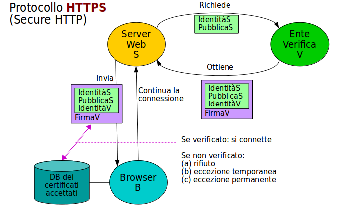

# Protocolli Sicuri

La _comunicazione sicura_ tra un server ed un client in Internet è composta da:

* assicurazione di confidenzialità
* assicurazione di provenienza

ed è ottenuta con l'uso di protocolli **a livello applicativo** (alto) che usano la crittografazione a chiave pubblica, basata su _PKI_.

Qualsiasi precedente tentativo di rendere sicuri i protocolli **TCP/IP** a livello intermedio o basso, è in pratica fallito, dato l'enorme numero di nodi di rete che si sarebbero dovuti modificare.

## HTTPS

Questa è la variante _sicura_ del protocollo alla base del web, lo **Hyper Text Transfer Protocol** (_HTTP_). Fa uso di protocolli a livello trasporto, detti:

* **Secure Socket Layer** (_SSL_)
  * originariamente inventato dalla _Netscape_, questo protocollo è ormai considerato troppo debole ed è deprecato
* **Transport Layer Security** (_TLS_)
  * è la variante moderna, standardizzata e sicura nella sua ultima versione

Il software di tutti i server web (_Apache_, _NginX_, ...) supporta _TLS_. Tutto quello che serve è il possesso di un _certificato_.

### HTTPS in Pratica

Un server web che voglia usare HTTPS deve ottenere un certificato da un _Certifying Authority_, pagando la commissione richiesta.

Due componenti vengono storati sul server, come due files:

* il certificato della chiave pubblica ottenuto
* la chiave privata corrispondente

E' da notare che il CA certifiica l'identità del server, non la sua probrietà od onesta o mancanza di malware. Dietro denubcia ed accertamenti il CA emettitore può sempre _revocare_ il cerificato.



Quando il browser apre una connessione HTTPS al server, questo gli invia il certificato contenente la chiave pubblica del server.

Se il browser accetta il certificato, allora inventa una chiave singola di _sessione_, la crittografa con la chiave pubblica del server e la invia al server.

Il rimanente della connessione è su un canale crittografato dalla chiave condivisa singola di sessione.

Il browser accetta il certificato se:

* è nel suo database locale di certificati accettati
* l'ente certificatore fa parte di un PKI il cui _Root CA_ è nel database

e il certificato non è stato revocato.

Se il certificato non è automaticamente accettato compare un grosso **Warning** bloccante che richiede all'utente una decisione:

* rifiutare la connessione - scelta _sicura_
* accettare solo questa connessione ed usare la chiave pubblica ricevuta (eccezione temporanea)
* inserire il certificato nel database ed accettare questa ed ogni futura connessione da questo web server (eccezione permanente)

La terza scelta può causare gravi problemi di sicurezza.

### Attenzioni

HTTP, non sicuro, è il protocollo di default. Quando si scrive la URL:

```text
www.example.com
```

è come aver scritto in modo completo:

```text
http://www.example.com/
```

Se richiediamo esplicitamente HTTPS occorre scrivere:

```text
https://www.example.com/
```

oppure installare del software **addd-on** al nostro browser che _forza_ sempre l'uso di HTTPS, come ad esempio **HTTPS Everywhere**.

Un sito web buono, fidato e conscio della sicurezza **deve** investire in un certificato e offrire HTTPS.

Il motore di ricerca di Google _penalizza_ il ranking dei siti che offrono solo HTTP.

E' opinione comune della comunità security che HTTPS sia penetrabile senza sforzo da parte della **National Security Agency** (_NSA_) americana.
