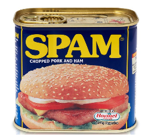

# Spamming e Antispamming

Lo **spamming** è l'invio di messaggi non richiesti ad un numero elevato di indirizzi di posta elettronica, anche milioni.

In misura minore sono colpiti anche altri ambienti applicativi e veicoli di Internet, come blogs, smartphones siti di condivisione e siti _social_.

Il nome deriva da una marca di carne di maiale in scatola, con una canzoncina che faceva parte della serie televisiva britannica _Monty Python_ negli anni '70.

Lo spamming origina principalmente dall'India, dalla Russia e dai paesi del Sud Est Asiatico. I paesi occidentali hanno controlli e penalità per la generazione di _spam_.

Se i messaggi inviati avessero solo contenuto pubblicitario allora il danno causato si limiterebbe all'uso indebito di _banda di rete_.

Il vero pericolo è che i messaggi di posta elettronica inviata possono essere pericolosi per la sicurezza.

## Pericoli dello Spamming

Tutti gli attacchi di _spam_ sono di _ingegneria sociale_ e quindi nella categoria **phishing**.

Non sono _spearphishing_ perchè l'attaccante non conosce se la vittima esiste o se è interessata a ciò che il messaggio offre.

Particolarmente famose sono diventate le seguenti categorie di Spam:

* Lettera Nigeriana - erediterai milioni di dollari da un corrotto ufficiale Nigeriano se solo ci dai i dati bancari a cui trasferirli; maggior dettagli qui
* Verifiche di Sicurezza - il tuo conto bancario è stato attaccato, procedi subito all'inserimento dei tuoi dati per verificare l'identità
* BegWare - la povera ragazza siberiana non ha soldi per comprarsi la stufa: clicca qui per vedere la sua fotografia
* Offerte Imperdibili - 80% di sconto sul viaggio, un nuovo lavoro statale appena liberatosi, vincita di un premio: segui il link per ulteriori dettagli
* Ricevute di Transazioni - il tuo acquisto di gioielli è andato a buon fine: questa è la ricevuta

Il proposito dell'attaccante è a tre livelli:

* veramente ricevere dettagli bancari o privati
* ridirigere ad un sito che invia malware
* soltanto verificare che la vittima esista, per ulteriori attacchi mirati

Alcuni circuiti commerciali usano uno spamming _semi-legale_ per condurre intense campagne pubblicitarie di prodotti e servizi più o meno validi. Le leggi occidentali richiedono il previo consenso da parte del destinatario, forse tramite siti web.

I criminali non inviano mai Spam da un indirizzo IP rintracciabile, ma da IP dinamici e variabili. Questi spesso appartengono ad ignari cittadini che ospitano inconsapevolmente programmi _zombie_.

## Filtri Antispam

Sono programmi dotati di un certo livello di _Intelligenza Artificiale_ che determinano, secondo loro algoritmi, se un messaggio sia vero o sia spam.

Ve ne sono sia Open Source, per esempio **ClamAV** per Linux, che facenti parte di _suite_ di antivirus commerciali.

Soffrono di due tipologie di errori:

* **falsi negativi** - un messaggio è spam ma viene considerato genuino
* **falsi positivi** - un messaggio è genuino ma viene considerato spam

I messaggi di spam possono essere:

* immediatamente scartati
* posti in una locazione speciale, di **quarantena**, da cui vengono tolti perennemente dopo un timeout di giorni, se un utente non li recupera

La locazione topologica nel flusso del messaggio di posta, ove installare un filtro antispam è:

* sul server di posta in uscita - gestito da un service provider
* sul server di posta in ingresso, gestito dal service provider o altro ente (ditta, università, ecc.)
* sul client di posta dell'utente

## Liste Antispam

I _Service Provider_ si accorgono presto dello spamming, sia per l'elevato numero di messaggi, sia per il fatto che molti hanno indirizzi di posta elettronica inesistenti e segnalano errori.

Possono comportarsi in due modi:

* ignorare lo spam ed assorbire il picco di banda passante usata
* segnalare la provenienza a **Liste Antispam** e scartare il traffico
  * notare che se il traffico è già partito vi sarà comunque nel presente una _spam storm_ da assorbire

Una _Lista Antispam_ non è altro che una lista di indirizzi IP segnalati da qualcuno, con più o meno autorità.

Ve ne sono a decine, alcune più autorevoli delle altre.

Molti Server di Posta Elettronica, prima di gestire un messaggio in partenza, controllano che l'indirizza del mittente non compaia in tali liste.

Teoricamente i Service Providers, prima di _affittare_ all'utente un idirizzo IP tramite **DHCP** (_Dynamic Host Configuration Protocol_), dovrebbero controllare che tale indirizzo non sia compromesso, cioè non compaia in tali liste.

Purtroppo non tutti lo fanno, per esempio **TIM**: una parte ragguardevole dei suoi indirizzi IP sono compromessi.

### Se si compare in una lista antispam

Gli indirizzi IP sono assegnati a blocchi ai loro possessori, con pagamento di un compenso. Il possessore ne è responsabile.

Se il nostro indirizzo IP è compromesso e listato occorre contattare il gestore della lista e dimostrare di aver installato opportuni filtri antispam.

Il possessore della lista riattiverà l'indirizzo IP compromesso, sotto osservazione per un periodo di tempo, poi lo toglierà completamente dalla lista.

Se l'indirizzo IP compromesso non è nostro, le possibilità sono:

* cambiare Service Provider
* ottenere un account di sola posta in partenza da un altro Service Provider, a pagamento naturalmente
* non usare programmi come Outlook o Thunderbird, ma WebMail

I client di posta elettronica inviano messaggi col protocollo **SMTP** (_Simple Mail Transfer Protocol_), WebMail usa naturalmente **HTTP** (_Hyper Text Transfer Protocol_).
