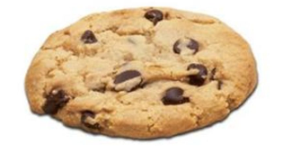
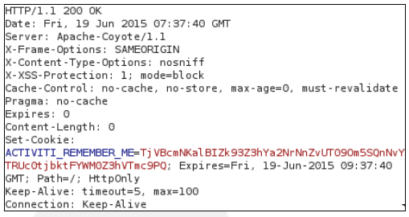
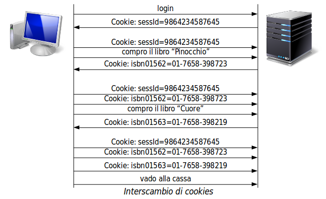
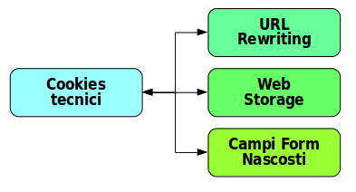
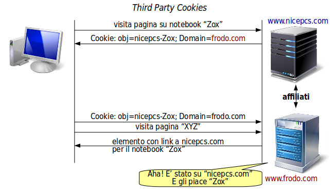
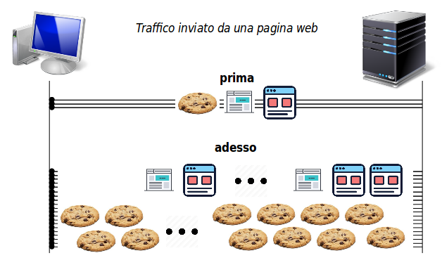

# Cookies

Un cookie è un'unità informativa minima: `nome=valore`, entrambi stringhe, usati nell'intercambio informazioni tra un browser e un server web, per mantenere stato.



In due frasi:

* in realtà non sono tecnicamente necessari
* praticamente tutti i siti li usano

In teoria sarebbe impossibile o oneroso per un web server mantenere informazioni storiche sui browsers che lo hanno visitato. Così il compito di _ricordarsi_ è affidato al browser, a cui il server invia uno o più _cookies_.

Un cookie viene inviato da un sito web al browser, che lo registra in un file di sistema. Il browser _restituisce_ il cookie ad un web server secondo le modalità specificate.

## Struttura di un Cookie

Un cookie è una linea della testata di un messaggio HTTP col formato:

```text
Cookie: nome=valore; attributo; attributo; ...
```

Almeno una coppia _nome_ e _valore_ è obbligatoria, e possono esservene più d'una. Tutti gli attributi sono opzionali. La lunghezza massima è 4095 bytes.

Esempio di cookie nel contesto della testata HTTP:



Gli attributi sono (notare che sono _case-sensitive_:

* **Domain** - richiesta al browser di restituire il cookie ad un sito web del dominio indicato. Default: solo il sito che ha inviato il cookie al browser.
* **Path** - specifica ulteriore di restituzione solo quando si accede ad un certo percorso sul server. Default: `/`.
* **Expires** - seguito da un timestamp, indica fin quando il browser deve mantenere il cookie. Default: sessione di collegamento, il cookie scade non appena il browser si collega ad un altro sito.
* **HttpOnly** - i programmi lato browser (JavaScript, ecc.) non hanno il permesso di accedere al cookie. Dicende dagli attacchi _Cross Site Scripting_ (XSS).
* **Secure** - il cookie può viaggiare solo su HTTPS, crittografato. Difende dagli _sniffer_.

## Uso Principale

L'uso originale dei cookies era per il mantenimento di **sessione**. HTTP è un protocollo **stateless**: per il server ogni richiesta è nuova, non c'è memoria se il browser abbia inviato richieste simili o correlate di recente.



Diventerebbe impossibile mantenere, per esempio, un carrello della spesa.

Un cookie è un _nome_ univoco inventato e ricordato dal server, seguito da una stringa casuale come _valore_, che identifica il browser, o meglio la _sessione_. 

Il **Session ID** viene registrato dal server in una locazione temporanea, e distrutto dopo un _timeout_ globale, o se l'intervallo tra due collegamenti consecutivi del browser supera un timeout.

I cookies di questo tipo si chiamano **cookies tecnici**.

### Alternative ai Cookies Tecnici



Se il problema è il mantenimento di sessione, l'alternativa principale, usata dall'_Application Server Tomcat_, è lo **URL Rewriting**.

Questo coonsiste nell'inserimento della coppia `nome=valore` come parte della stringa _URL_ stessa, e il traffico è inviato col metodo **POST** per impedire che sia _visibile_, e probabilmente con HTTPS per impedire che sis _sniffabile_:

Purtroppo Tomcat si programma in Java, e la maggior parte dei giovani ed economici programmatori conosce solo il PHP e altri linguaggetti.

Se il problema è lo storaggio di materiale da _ricordarsi_, l'alternativa di HTML versione 5, si chiama **Web Storage** con una lunghezza fino a 5 megabytes.

Il Web Storage ha i suoi problemi di sicurezza, però, poichè è molto vulnerabile a _Cross SiteScripting, e va gestito con cura.

Anche qui molti giovani programmatori non sanno cos'è.

## Altri Usi dei Cookies

A parte la gestione di sessione i cookies possono essere usati per:

* **personalizzazione** - prefernze ed esperienza utente nella fruizione di un sito
  * temi, colori, lingua, locale ed altri settaggi
* **tracciamento** - registrazione del comportamento dell'utente

L'ultimo caso è il più _pericoloso per la privacy_.

Se l'attributo **Domain** è impostato non necessariamente indica il dominio a cui appartiene il server o il browser, ma un dominio terzo. Questi si chiamano **Third Party Cookies**.



Quasi tutti i browser hanno un limite ai cookies che appartengono allo stesso dominio, anche se è liberalmente settato a più di 50. Praticamente nessun browser ha limitazioni al numero _totale_ dei cookies ricevuti.

I web servers appartengono a circuiti commerciali che richiedono che ai browser venga inviato un cookie col loro _Domain_. I servers vivono dopo tutto con questi servizi commerciali, e alcuni di loro inviano anche centinaia di cookies.

I circuiti di _analytics_ sanno quindi la storia di navigazione di tutti i siti del circuito visitati.

Molti dei siti aderenti al circuito hanno quindi link _parametrici_ che presentano inserzioni pubblicitarie mirate, ove il parametro è uno dei siti del circuito visitai di recente.

I server sono più che contenti di ospitare i link parametrici perchè percepiscono la commissione di **click-trough** ogni volta che l'utente segue uno di questi link.

### Considerazioni

Se fossimo in ambito di _ingegneria sociale_ potremmo parlare di **spearphishing** legale ed istituzionalizzato.



Anticamente (15 anni) una pagina web apriva un paio di connessioni parallele al massimo, su cui transitavano una decina di richieste con (forse) un cookie. Se si disabilitavano i cookie sul browser quasi tutto funzionava comunque.

Al giorno d'oggi una pagina apre tipicamente 8 connessioni simultanee, su cui transitano 80 elementi di pagina con almeno 50 cookies.

I server web hanno normalmente un database per la gestione di queste complesse situazioni di _referral_ e di _click-through_, che viene ad occupare molto più spazio di quanto basterebbe per il controollo sessione con memoria sul server e senza alcun bisogno di cookies.

Usiamo i cookies per scopi di marketing, non tecnici.

Vi sono stati di recente casi imbarazzanti di rivelazione indebita di comportamenti o situazioni deriivate dalla conoscenza della navigazione:

* un padre scopre che la figlia è incinta perchè riceve buoni sconto per un negozio di maternità
* un prelato americano si suicida perchè un sito porno gli invia auguri di Buon Natale

La legge europea prevede ora il _consenso informato_ all'uso dei cookies. Tradotto: o accetti i cookies o te ne vai dal sito. Come la legge sulla privacy.
