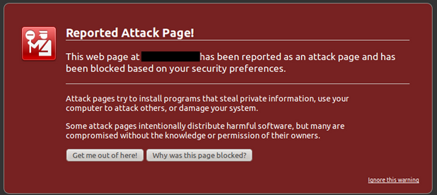
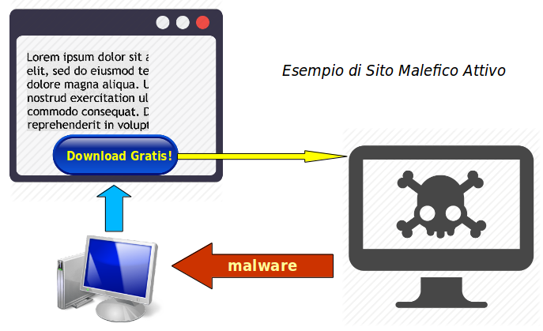
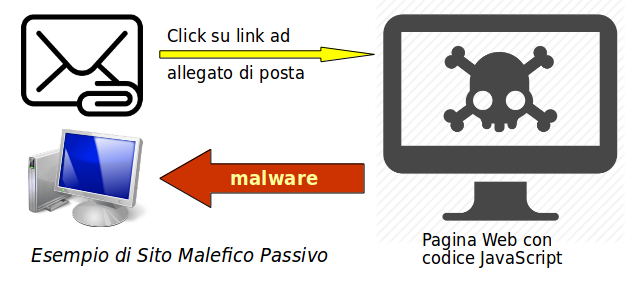

# Siti Malefici

Lo scopo di un _Sito Malefico_ è di installare _malware_ nel computer di chi lo visita, ai fini principali di:

* carpire informazioni
* rendere il computer uno _zombie_
  * controllarlo da remoto
* installare _ransomware_
* incapacitare o distruggere il computer

Vene sono di due tipi, attivi e passivi.

## Siti malefici attivi

Richiedono che l'utente compia operazioni. Sembrano quasi sempre siti legittimi, sono attacchi di _ingegneria sociale_.

* Installazione di un _codec_ per vedere un certo formato video. I codec sono software attivo.
* Richiesta di permesso per l'installazione di un programma, e poi ne viene installato un altro
* Siti che _regalano_ l'ultima versione di un **antivirus**
* Siti che forniscono _gratuitamente_ **software piratato** (è proprio andarsela a cercare: poi lamentati)
* Finestre di _pop-up_ con messaggi imbroglio: in realtà si acconsente allo scaricamento di un programma.
* Bottoni o Link che imbrogliano

### Contromisure

* Non installare mai software da un sito
  * Solo software dalla propria distribuzione, anche se vecchio rispetto a quello proposto dal sito
  * Solo software Open Source e in formato sorgente, per poi compilarlo localmente
    * Ci fidiamo che non vi sia malware perche un numero _sufficiente_ di programmatori deve avere visto il codice. Non è sempre vero.
    * Il codice Open Source deve anche provenire da un sito fidato. Tutti mettono tutto quello che vogliono su _GitHub_.
* Non installare mai _antivirus_ o _prodotti crittografici_ se non li abbiamo acquistati da una ditta tracciabile e di sicura reputazione
* Configurare il browser per evitare qualsiasi tipo di _pop-up_
* Non andare su siti di dubbia reputazione
* Esercitare continuamente una sana paranoia

> Se un prodotto è gratis, tu sei il prodotto

## Siti malefici passivi

Non richiedono alcuna attività da parte dell'utente. Sono detti anche **Drive-by Downloads**. Basta che l'utente visiti la pagina.

Una pagina può contenere, e quasi sempre lo fa, del codice JavaScript. Questo viene scaricato sul computer dell'utente ed eseguito, coi privilegi che ha l'utente sulla propria macchina.

### Contromisure specifiche

* Non compiere mai login come _administrator_ o _root_
* Non configurare mai privilegi amministrativi automatici - in Linux: togliere la password a _sudo_
* Usare un Browser che esegua i programmi JavaScript in un _sandbox_, staccati cioè dal sistema sottostante
  * Esempio: Google Chrome, ma in tal caso si perde la privacy
* Installare un _download blocker_ o configurarlo nel proprio browser
  * Esempio: Firefox
* Installare programmi di protezione specifici
  * Esempi: _Norton Security_, _NoScript_

## Soluzione Generica: 2 computer

Due tipi di navigazione:

* pedanticamente prudente - noiosa e sicura
* scellerata - divertente ma pericolosa

Due computer diversi per i due tipi di navigazione.

La navigazione scellerata va eseguita su un computer sacrificabile, con le seguenti caratteristiche:

* costa poco e anche se si rompe, si rovina o si perde non c'è da preoccuparsi troppo (il **Computer Bic**)
  * lo buttiamo dopo un paio d'anni perchè obsoleto
* reinstalliamo da zero il sistema operativo ogni pochi mesi
  * con Linux ci vuole al massimo un'oretta
  * possiamo provare le ultime _features_
* si possono esplorare siti nuovi e forse interessanti, e forse pericolosi
  * manteniamo comunque la massima avvedutezza di navigazione, ma senza paure croniche

Il computer _serio_ ha invece queste caratteristiche:

* prevediamo di tenerlo sui quattro anni almeno
* il sistema operativo è stabile e supportato
* é staccato dalla rete di default, tranne quando
  * compiamo aggiornamenti al sistema operativo
  * ci colleghiamo ad un numero _limitatissimo_ di siti fidati
    * quali siano l'abbiamo imparato dalla navigazione _scellerata_
* il browser ha sofware e configurazioni extra di protezione
* ha antivirus validi e _pagati_
* compiamo un regolare backup su supporto esterno
  * l'intervallo regola la _massima perdita accettabile_ di dati
* il file system è crittografato
  * ad una persona di fiducia abbiamo detto la password

### Soluzione migliore: 3 computer

Il terzo è per la **posta elettronica**, che è un tale pericolo per la sicurezza da rendere la navigazione scellerata una passeggiata al parco.

