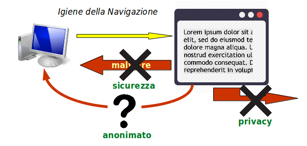
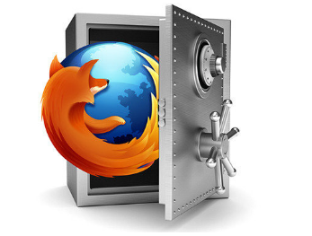
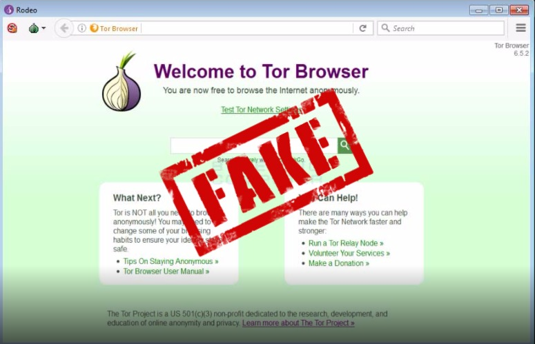
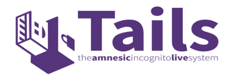
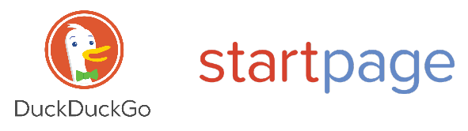

# Igiene del Surfing

Vi sono tre desiderabili qualità nella navigazione dei siti web:

* **sicurezza** - l'assenza di attacchi CIA ai nostri dati
* **privacy** - l'aspettativa che altri non conoscano i siti da noi visitati
* **anonimato** - la certezza di non poter essere identificati

La sicurezza è fondamentale e consiste nella difesa dagli attacchi descritti nella lista OWASP Top 10.

Alcuni di questi attacchi non dipendono dall'utente che usa il browser, ma:

* dal programmatore che ha inserito dei bachi nel software (accidentali ma anche intenzionali)
  * usare solo software Open Source
* dal web master che ha redatto pagine pericolose o malefiche
  * riferirsi a cataloghi di siti con _malware_

Altri attacchi dovuti invece agli hacker sono:

* Iniezioni di programma
* Cross Site Scripting (XSS)
* Cross Site Request Forgery (CSRF)

La privacy e l'anonimato sono il _recto_ e il _verso_ della stessa medaglia. Dato l'ambiente in cui viviamo e operiamo (stato, ditta, famiglia, ...) vi saranno sempre attività:

* illegali
  * Cristianesimo, femminismo, omosessualità in alcuni stati arabi
  * apologia del Fascismo, diniego della Shoah, ...
* immorali
  * siti porno
  * giochi d'azzardo
* imbarazzzanti
  * siti per future mamme
  * appuntamenti online

Vi sono due strumenti di difesa:

* un browser e software adeguato
* comportamenti di navigazione difensivi

## Il Browser

Vi sono cinque browsers che vengono in cima alle classifiche di sicurezza nell'ultimo anno.

* **Chrome**
  * E' il top per quanto riguarda la sicurezza intrinseca
  * La privacy è molto scarsa poichè Google raccoglie tutte le informazioni e le può rivendere
* **Firefox**
  * Ha sicurezza buona ma non massima
  * La privacy è ottima
  * E' completamente Open Source - l'unico tra i maggiori browser
* **Edge**
  * Solo per Windows 10
  * Buona sicurezza e privacy in generale
  * Il codice è completamente opaco e la Microsoft probabilmente raccoglie informazioni
* **Opera**
  * Espandibile e personabilizzabile
  * Medio nella privacy, buona la sicurezza
* **Internet Explorer**
  * Qualche notevole difesa di privacy
  * Un colabrodo per la sicurezza
  * Solo per Windows

## Firefox

E' la soluzione migliore ed è disponibile per tutti i sistemi operativi - nella versione Windows ha alcuni bachi di buffer overflow.

Evidentemente va costantemente mantenuto aggiornato all'ultima versione, che pone patch alle ultime vulnerabilità scoperte.

Le sue debolezze di sicurezza possono essere mitigate con l'installazione di _Add-Ons_:

* HTTPS Everywhere
  * Forza l'uso di connessioni crittografate quando il server web ne dispone
    * il motore di ricerca di Google favorisce i siti HTTPS nell'indicizzazione
* NoScript
  * E' il singolo principale strumento di sicurezza, tanto che è di default installato su _Tor_
  * Permette di configurare granularmente da quali siti accettiamo JavaScript o altri contenuti attivi
  * allerta su possibili attacchi XSS e CSRF e ci permette di bloccarli

L'aumento della privacy è ottenuto dalla serione _Sicurezza e Privacy_ delle preferenze. I settaggi consigliati sono:

* Accettare i cookies o il 90% dei siti web oggigiorno diventano inusabili, ma
  * Bloccare i cookies da terze parti che servono solo alla profilazione di navigazione per scopi, al meglio, commerciali
* Usare sempre la Protezione dal Tracciamento
* Mandare sempre ai siti web l'opzione 'Do Not Track'
  * Serve a poco perchè solo quelli onesti obbediscono, ma tant'è
* Non permettere a nessuno di identificare la locazione
* Non permettere a nessuno l'uso della videocamera o del microfono
  * Coprire con un nastro adesivo opaco la lente della videocamera e il microfono. Toglierlo temporaneamente se si vuole usare Skypa, ma attenzione che Skype è _molto_ pericoloso per la sicurezza
* Non permettere a nessuno di inviare notifiche
* Bloccare le finestre di _pop-up_
* Avvertire dei tentativi di installazione di _add-ons_
* Disabilitare i servizi di accessibilità, a meno di averne bisogno
* Bloccare i contenuti pericolosi o ingannevoli
  * Bloccare i download pericolosi
  * Avvertire con software insolito
* Verificare sempre i server OCSP per controllare la validità dei certificati ricevuti

## Tor e Tails

**Tor** è un browser basato su una versione non ultima di Firefox, con tutti i settaggi di sicurezza attivati.
E' anonimo quando usa la rete _Onion Routing_, altrimenti non lo è e si comporta come un normale Firefox. La rete Onion rallenta molto la velocità.

Solitamente si usa Tor quando si desidera navigare nel _Dark Web_ ed acquistare in _Bitcoin_ materiali altrove irreperibili.

Attenzione ad ottenere Tor dal sito ufficiale. Vi sono alcune versioni _fake_ che rubano i _Bitcoin_.

Questa osservazione è valida anche quando si scaricano altri applicativi _desiderabili_ e ai margini della legalità.

### Tails

Vi possono effetti subdoli però del sistema operativo sottostante, che permettono la divulgazione di informazioni anche se si usa _Tor_.

La soluzione è di usare **Tails**, un sistema operativo derivato da Linux, installabile su chiavetta USB con boot e che include Tor come software.

Tails è calibrato fin nel kernel per avere il massimo anonimato di base, poichè nulla viene registrato e tutto è perso all'atto dello spegnimento: è un sistema **amnesico**. Tanto che la mappa di tastiera e la password amministrativa devono essere settate ad ogni boot.

Eventuali dati che vogliamo conservare possono essere posti in un filesistem crittografato **Luks**, leggibile anche da altri Linux.

Anche Tails va mantenuto aggiornato.

## Motori di Ricerca

**Google Search** non solo registra tutte le nostre ricerche, ma ne deriva una fervente attività commerciale.

Praticamente tutti i maggiori motori di ricerca registrano i nostri interessi e cercano di venderli. E' solo che Google ha avuto più successo.

Ci sono però alcuni motori di ricerca che non registrano nulla, ma sono dovuti però ad iniziative private o di collettivi libertari, sono più lenti e i risultati non sono così completi. I principali sono:

* DuckDuckGo - già inserito in Firefox
* StartPage - add-on per Firefox

Il grosso problema dei comuni motori di ricerca è che i risultati ritornati dipendono dal profilo che il motore si è costruito dell'utente nel tempo.

C'è chi lo chiama personalizzazione, e chi lo chiama censura.

