# Protocolli TCP/IP

## Modello DoD

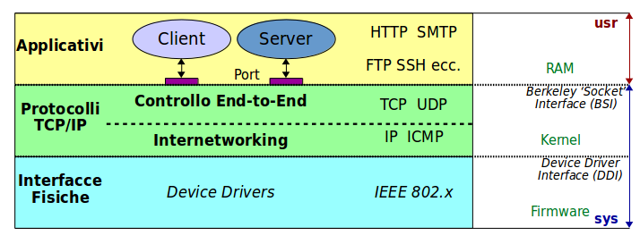

I protocolli di rete sono basati sul **Modello DoD** (_Department of Defense_ - 1969), con cui si eseguivano le comunicazioni sull'originaria _ARPAnet_.

L'implementazione per Internet è a partire dal 1980 (Univ. California) ed è stata sviluppata su sistemi _Unix_.

Ha numerose vulnerabilità di sicurezza, che al tempo non era un problema percepito. Purtroppo questa situazione non si può cambiare, dato il numero enorme di nodi Internet che usano questi protocolli.

E' un modello a tre livelli del software di comunicazione, per favorire l'interoperabilità tra _Vendors_ differenti. Ogni fornitore di sofware lo fà ad un livello specifico, e può comunicare con gli altri livelli software perchè le interfacce sono ben definite.

## Datagramma IP

Tutti i dati transitano in Internet in **pacchetti** dati, della dimensione massima di 64 Kilobyte ciascuno, ma solitamente inferiori ai 1500 byte. Le reti fisiche a basso livello non consentono il passaggio a pacchetti più grandi.

Un pacchetto a livello _internetworking_ del _Modello DoD_ è gestito dal protocollo **IP** (_Internet Protocol_) e si chiama un **datagramma**.

Tutte le informazioni necessarie al protocollo IP si trovano nella testata del datagramma,con una struttura fissa.

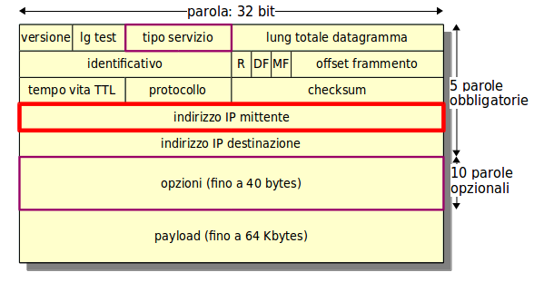

Nei quasi 60 anni della sua storia il protocollo IP si è evoluto, per cui alcuni campi sono diventati obsoleti, ma la struttura originale del datagramma non può cambiare.

Vi sono tre grosse vulnerabilità:

* Non c’è alcuna autenticazione dei campi, in particolare dell’indirizzo IP del mittente
  * O il computer ricevente si fida della verità di ciascun campo, o non ha modo di verificare
* Altri campi possono trasportare informazioni nascoste (fuori banda)
  * Un campo non più usato nello smistamento può comunque contenere delle informazioni nascoste per comunicazioni _stealth_
* Tuttele opzioni possibili o sono inutili o potenzialmente pericolose

### Spoofing

La contraffazione (_spoofing_) dell'indirizzo del mittente è un requisito di base di molti attacchi.

IP del mittente è volutamente falso:

* o per nascondere l’identità del mittente vero
* oppure per impersonare un altro mittente, fidato

Alcuni servizi usano solo l’indirizzo IP per autenticare. Nel caso della richiesta di esecuzione di un comando, non c'è alcuna protezione.

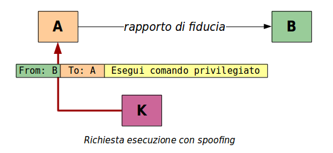

L’ottenimento di informazioni riservate è più complesso ed implica una mofifica del routing.

Vi sono molti modi di modificare il routing, per esempio con falsi messaggi di _Route Update_.

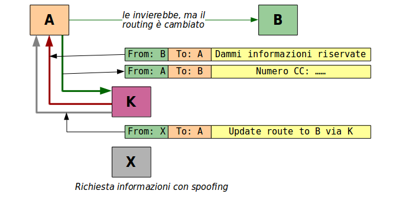

### Avvelenamento di Cache ARP

Per risolvere l’indirizzo **MAC** a livello Interfacce Fisiche dall’indirizzo IP dei Protocolli di Rete si usa il protocollo **ARP** (_Address Resolution Protocol_).

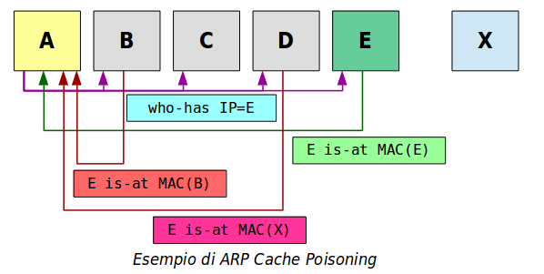

Svolgimento normale:

* Il richiedente invia una richiesta broadcast `who-has` alla LAN con parametro l’indirizzo IP.
* Il nodo che riconosce il proprio indirizzo IP risponde con un pacchetto unicast `is-at` col proprio indirizzo MAC.
* Il richiedente lo segna in una cache per due minuti.

Attacchi - è un altro nodo che risponde:

* Col proprio indirizzo MAC
* Con l’indirizzo MAC di un terzo o inesistente

Per due minuti la cache ARP è _avvelenata_ - la comunicazione è impossibile. Poi l'effetto si ripete.

Contromisura.

Anzichè usare il protocollo ARP che è dinamico, configurare gli indirizzi MAC in un file statico: `/etc/ethers`.
Purtroppo è molto oneroso mantenere questo file aggiornato su tutte le macchine della LAN.

E’ un attacco di Diniego di Servizio. E’ raro che più di un nodo compia l’attacco.

Il nodo colpevole è probabilmente stato infettato tramite Ingegneria Sociale.

## TCP

A livello _End-to-End Communication_ vi sono due protocolli:

* **TCP** - _Transmission Control Protocol_ - affidabile ma lento, per file transfer, posta, web, ecc.
* **UDP** - _User Datagram Protocolo_ - veloce ma inaffidabile, per streaming, DNS, ecc.

Ciascuno ha la sua testata, con campi specifici.

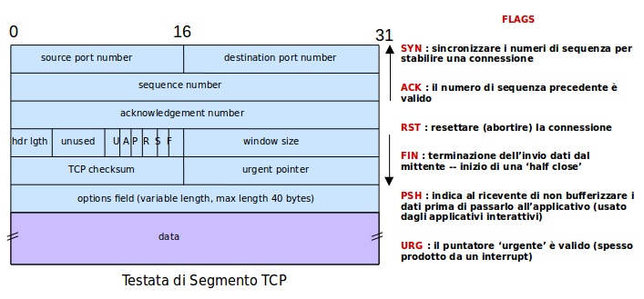

Il protocollo TCP è _stateful_, ed esegue connessioni. Una serie di _flags_ binari denotano in quale stato si trovi la comunicazione. Non tutte le combinazioni di flags sono possibili però.

Inviare un pacchetto con i flag sbagliati perlo stato corrente permette molte tipologie di trucchi ed attacchi.

### Connessione Normale

Lo stabilimento di una connessione TCP è uno **Handshake a Tre Vie**.

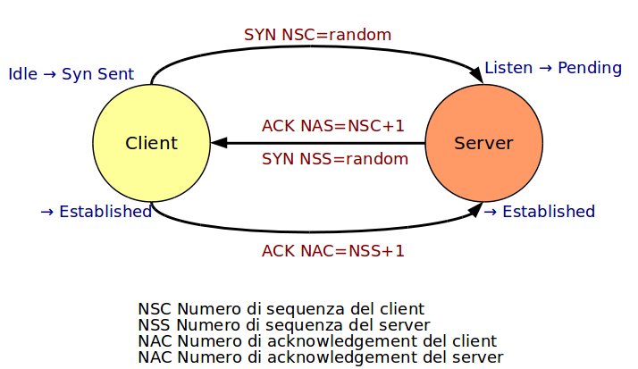

### Connessione Anomala

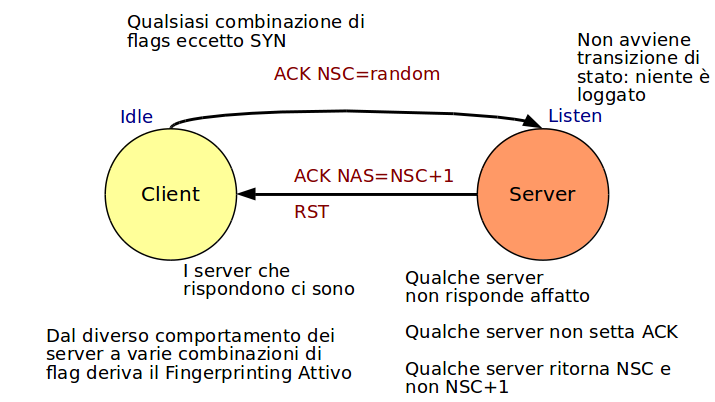

Se i flag dei pacchetti sono fuori sequenza, il server invvia un pacchetto col flag **RST** (_reset_) e non compie la connessione (o il logging). Ha però tradito la sua presnza: è stat una **scansione stealth**.

### Syn Flood

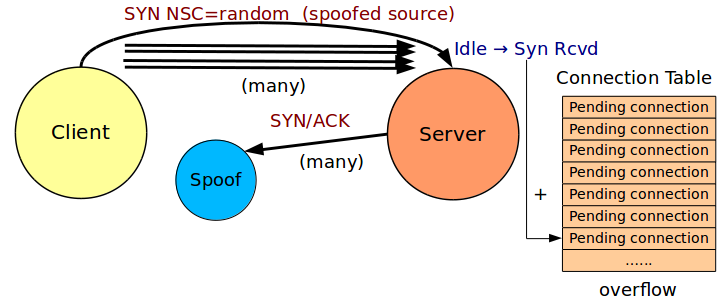

Lo hacker dal client manda al server una sfilza continua, uno ogni 10 millisecondi, di pacchetti col flag `SYN` settato.

Il server per ciascuno di essi apre una connessione `pending` (in corso) nella tabella delle connessioni, quindi invia al client il responso `SYN ACK` e attende lo `ACK` finale per un timeout tipico di 20 secondi.

In 20 secondi riceve però 2000 richieste di connessione, mai nessuna terminata, e la tabella delle connessioni può andare in overflow.

Il traffico _vero e onesto_ viene rallentato, forse impedito dall'attacoo DOS, finchè non è terminato.

## ICMP

Lo **Internet Control Message Protocol** è un protocollo ausiliario ma obbligatorio e invia _messaggi_ in datagrammi IP.

Compiti:

* Feedback per problemi di recapito
* Incrementare l'efficienza globale di rete

E' utilizzato in molti attacchi hacker, tanto che molti messaggi ICMP sono di solito disabilitati. Infatti alcuni messaggi ICMP sono ormai obsoleti, e vi sono altri metodi per ottenere gli stessi servizi.

Qualche utilities però usa ancora ICMP, per esempio `ping`.

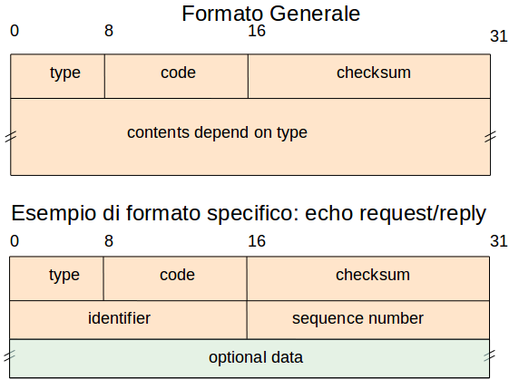

### File Transfer su ICMP

Il controller remoto che ha infettato una macchina locale deve poter comunicare con essa, per esempio per trasferire files di materiale confidenziale.

Spesso il ping ha il permesso di transito dal firewall.

Questo corrisponde ai tipi:

* 8 - **Echo Request** (“ping”)
* 0 - **Echo Reply** (“pong”)

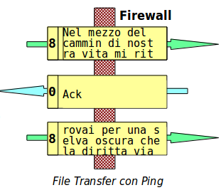

Purtroppo il payload del ping arriva a 64 Kbyte.
Usandone 500 per pacchetto per non causare sospetti si può comunque trasferire un file.
Per accorgersene occorre avere nella rete uno **Intrusion Detection System** ben calibrato.

### Attacco Smurf

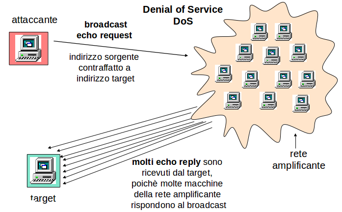

In inglese _smurf_ è un _puffo_.

Il `ping` viene anche usato per un attacco di _Diniego di Servizio Distribuito_ (DDOS). Viene inviato un ping ad un indirizzo **broadcast** che identifica una rete intera con anche migliaia di computer, la **Rete Amplificante**.

L'indirizzo del mittente del `ping` è _spoofed_: è quello della vittima.

Un computer non dovrebbe mai rispondere ad un ping broadcast, ma computer vecchi lo fanno, oppure altri dispositivi che non sono PC (_Internet of Things_).

La vittima si vede subissata da migliaia di `pong` al secondo, e soccombe.

### Attacco Stacheldraht

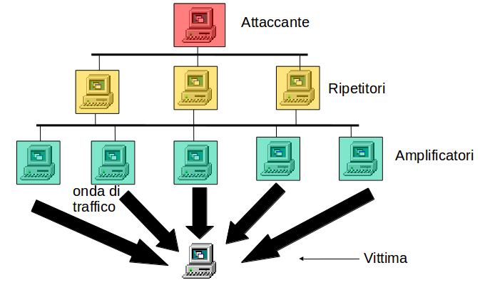

_Filo spinato_, in tedesco.

Se le reti amplificatrici sono molte, e sono gestite da una BotNet di _Ripetitori_, la vittima può anche ricevere milioni di pacchetti al secondo.

A questo punto però sono le reti dei Service Provider che cedono per prime.

## Attacchi a Frammentazione

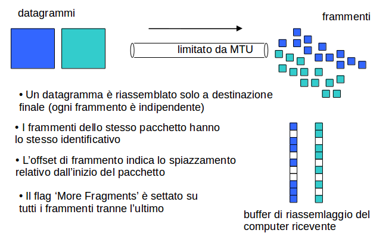

Una rete fisica ha un massimo di byte che può trasferire in un'unica _trama fisica_: lo **MTU**, _Maximum Transfer Unit_, tipicamente di 1500 bytes.

Se un datagramma IP è di dimensioni maggiori, questo viene spezzato in sottopacchetti più piccoli, i **frammenti**.

Ogni frammento viaggia indipendentemente dagli altri e solo la destinazione finale è in grado di ricomporre il pacchetto.

L'invio di frammenti speciali, costruiti ad arte, può causare tutta una serie di problemi al ricevente, al limite fermarlo, e condurre così un _Diniego di Servizio_.

Gli attacchi sono una miriade, basati, p.es., sui problemi:

* i frammenti dello stesso pacchetto sono troppi
* i frammenti sono parzialmente sovrapposti
* un frammento sovrascrive un altro frammento
* vi sono 'buchi' fra i frammenti

La frammentazione è al giorno d'oggi deprecata da tutti i sistemi operativi moderni.

### Ping della Morte

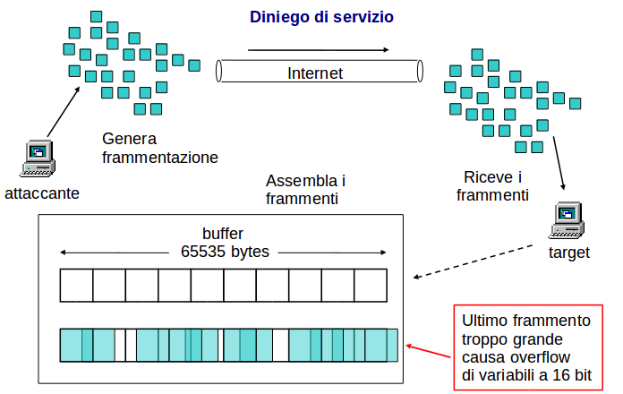

Nessun pacchetto `ping` può essere più grande di 64 KB alla partenza, ma se l'attaccante invia un numero molto elevato di frammenti, la cui somma è superiore a 64 KB, il ricevente andrà in **overflow**.

