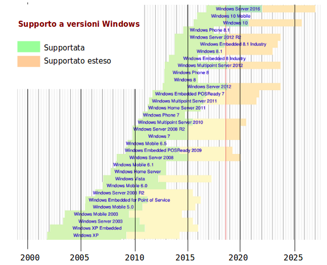
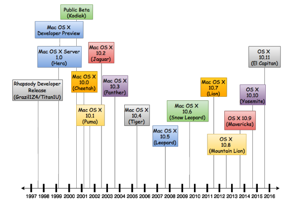
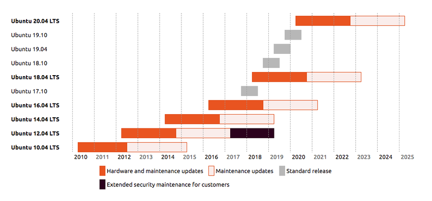

# Contrasto alle Debolezze

## Sistema Operativo Moderno

Vengono scoperte decine di vulnerabilità ogni anno di ogni versione di sistema operativo moderno. Se il sistema operativo èancora supportato dal produttore, vengono distribuite le **patch** di sicurezza, altrimenti la vulnerabilità rimane.

Occorre usare un sistema operativo supportato al presente e nel futuro prevedibile.

Occorre mantenere aggiornato il sistema operativo e applicare al più presto le patch di sicurezza.

Chi usa versioni non supportate non solo corre dei rischi personali, ma **danneggia la rete locale**, permettendo l'ingresso di _malware_. E' da considerarsi un **comportamento irresponsabile**, alla stregua di mandare un bambino non vaccinato a scuola.

### Supporto a Windows

L'unica versione possibile al momento è **Windows 10**.

Per chi ha una licenza con supporto esteso, **Windows 7** è al limite.

Molti purtroppo lo usano ancora, ma **Windows XP** è da scartare al più presto.

## Sistemi Unix

Unix ha una lunga storia di sviluppo. _Tutti_ i sistemi operativi moderni sono discendenti di Unix, chi più e chi meno, incluso Windows.

Lafigura mostra le principali varianti di Unix (non Windows) circa un anno fa'.

### Mac

La Apple non ha una schedulazione precisa di supporto futuro delle proprie versioni **MacOS**:

Si può in generale attendersi un supporto della durata di 4-5 anni dall'uscita di una versione.

Qualsiasi versione anteriore a **Mountain Lion** è da considerarsi obsoleta.

### Linux Ubuntu

La ditta **Canonical** fornisce nuove versioni di Ubuntu di due tipologie:

* versioni standard, ogni 6 mesi, supportate per 8 mesi
* versioni **Long Term Support** (_LTS_), ogni 2 anni, supportate attivamente per 2 anni, e con patch di manutenzione per altri 2 anni

La versione corrente da adottare al più presto è la **18.04 LTS**. La precedente versione stabile, **16.04 LTS** è entrata in fase di mera manutenzione, non sviluppo.

Clienti che lo richiedano, e paghino una adeguata licenza - praticamente grosse realtà industriali o enti pubblici americani - possono avere la variante _server_ di Ubuntu mantenuta per ulteriori 2 anni.

